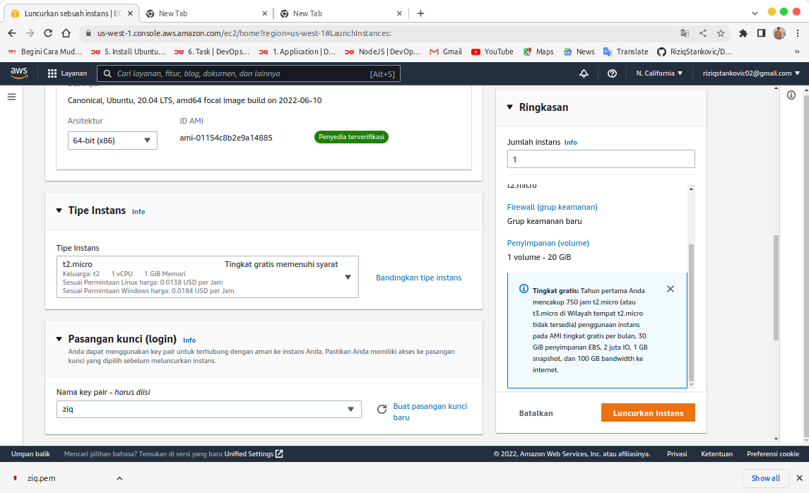
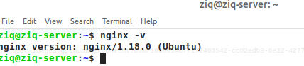
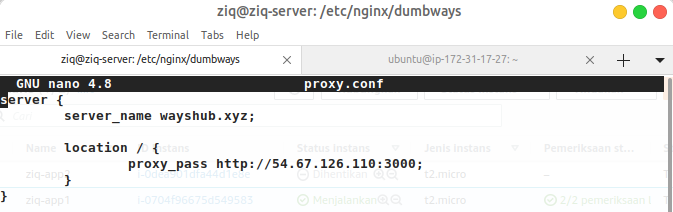

Secara konsep, definisi Cloud Computing berarti menyimpan dan mengakses data dan program melalui internet dari lokasi berbeda dimanapun berada asalkan terhubung dengan jaringan internet sehingga bisa di kelola oleh device(Computer, SmartPhone) menuju hard drive yang tersimpan.

# Membuat Server Gateway dan Aplikasi menggunakan IdCloudhost & AWS


PT Cloud Hosting Indonesia (IDCloudHost) Merupakan Salah Satu Web Hosting Provider yang Ada di Indonesia dengan Menawarkan Layanan Seperti Pendaftaran Domain, Cloud Hosting, Server (VPS & Dedicated Server), Reseller Domain & Hosting, dan Beberapa Fitur Layanan Lainnya.

Langkah Pertama sebelum membuat server gateway terlebih dahulu harus membuat server itu sendiri dimana kita menggunakan Virtual Privat Server atau bisa juga disebut dengan VPS di IDCloudHost 
Klik Link [ini](https://idcloudhost.com/) untuk membuat akun nya kemudian login sebagai console 

 

    - silahkan login or Sign In jika blom punya akun
 
 


 

    - Trus CONFIGURASI VPS nya 

 

 

 

 
 
    - klo sudah silahkan integrasikan ke terminal dengan perintah
```
ssh nameserver@IP-PUBLIC
```

 

atau juga bisa membuatnya di platform luar indonesia yaitu AWS klik link [ini](https://aws.amazon.com/id/) untuk membuat akunya dengan menggunakan server CE2, VPS sama halnya dengan di IDCloudHost.


    - pergi navbar kiri lalu klik instans


    - kemudian Luncurkan Intens Membuat Server


    - IKUTI langkah Berikut 


    - 1


    - 2



    - 3


    - 4


    - 5


    - 6


    - 7 Kemudian Hubungkan Ke cmd Melalui Command line di aws


    - 8 Hubungakn dengan file format .pem berada


    - 9 jika selesai Terhubung sperti PIC di bawah 


    - kemudian langsung install gateway nya


```
sudo apt update ; sudo apt upgrade
```
```
sudo apt install nginx
```




    - nginx -v

    - kemudian configurasi ke nginx.conf 


    - buat direktori khusus untuk menampung domain


    - tambhkan include /etc/nginx/dumbways/*; menggunkan format * untuk mengeksekusi smuanya dlm folder


```
sudo nginx -t
```

    - untuk memeriksa test fail

# Install Aplikasi



    - masukan configurasi ip applikasi untuk di sambungkan ke gateway


    - kemudian install aplikasi nya di server berbeda

    - disini saya menggunakan aws dan juga idch tapi saya tulis menggunkan idch 
```
git clone https://github.com/dumbwaysdev/wayshub-frontend
```

    - clone with github 


    - instal npm nvm node
```
sudo apt install npm
```
```
curl -o- https://raw.githubusercontent.com/nvm-sh/nvm/v0.38.0/install.sh | bash
```
```
exec bash
```
```
nvm install 16
```
```
npm i
```


```
npm install pm2 -g
```


    - buat folder ecosystem di dalam folder
```
pm2 ecosystem simple
```

    - lakukan edit di file ecosystem
```
module.exports = {
  apps : [{
    name   : "frontend-wayshub",
    script : "npm start"
  }]
}
```

    -kemudian configurasi file js nya dan
```
pm2 start ecosystem.config.js
```


    - cek di browser menggunkan ip 


# install domain dan ssl cert bot


    - configurasi domain dengan ip gateway public dan domain di direktori yang sama kmudian cek hasilnya udah ke konek ke domain or no


    - hasilnya udah konek but status masih not secure blom ada keamanan krna ssl blom di install 


    - langsung install certbot but jan lupa untuk restart nginx.service nya
```
sudo snap install core; sudo snap refresh core
```
```
sudo snap install --classic certbot
```
```
sudo certbot
```


    - ssl berhasil di iinstall pergi ke browser untuk melihatnya 
    


