# Membuat server backend dan database menggunakan [IdCloudhost](https://console.idcloudhost.com/hub/login)

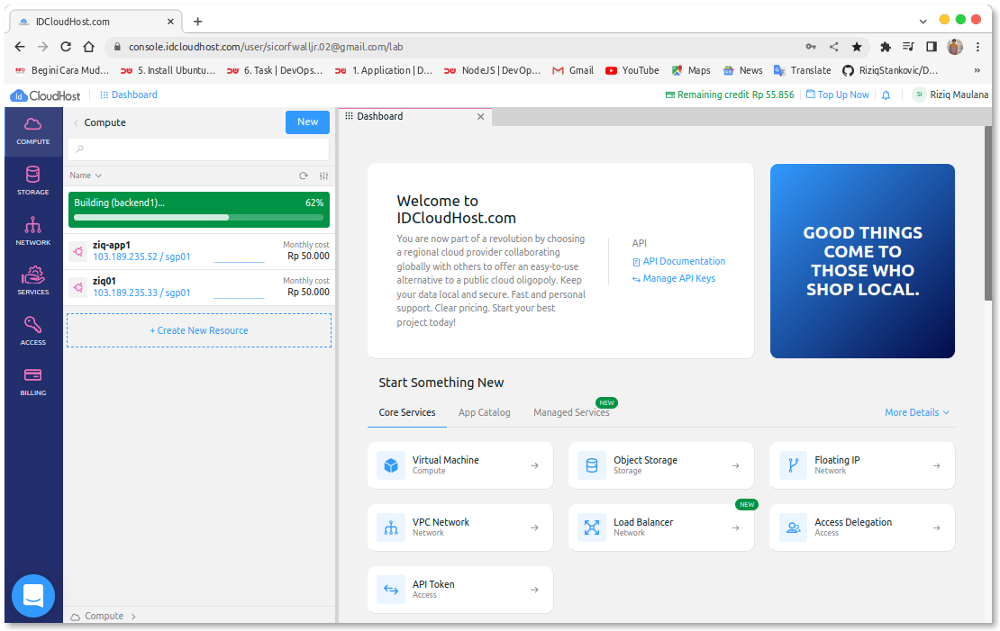
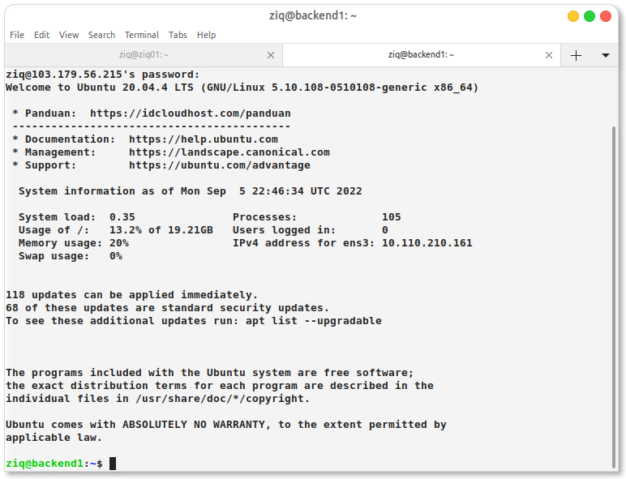

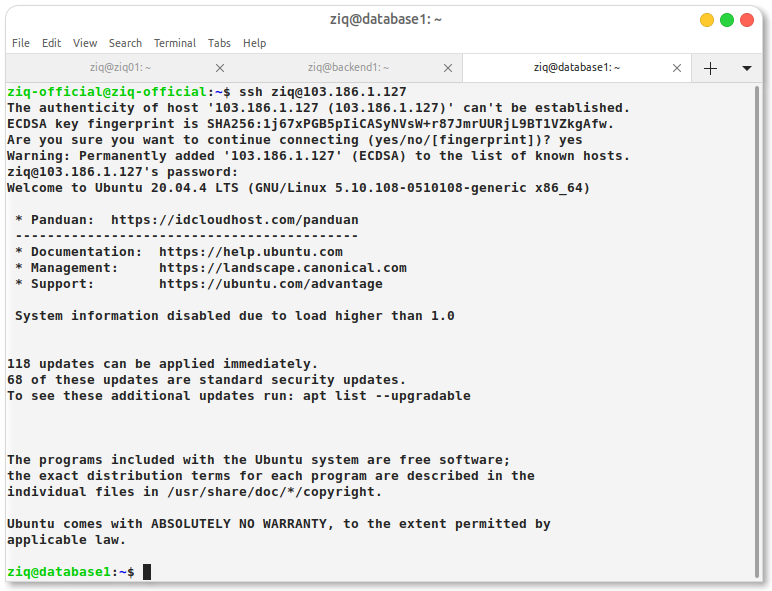

# 1. Setup ssh key antar server
# Generate SSH key and transfer ke smua ssh server

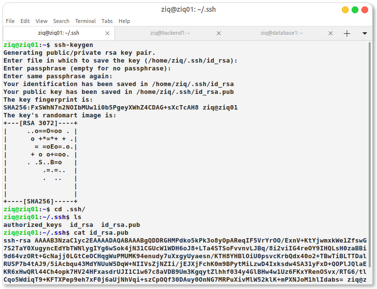

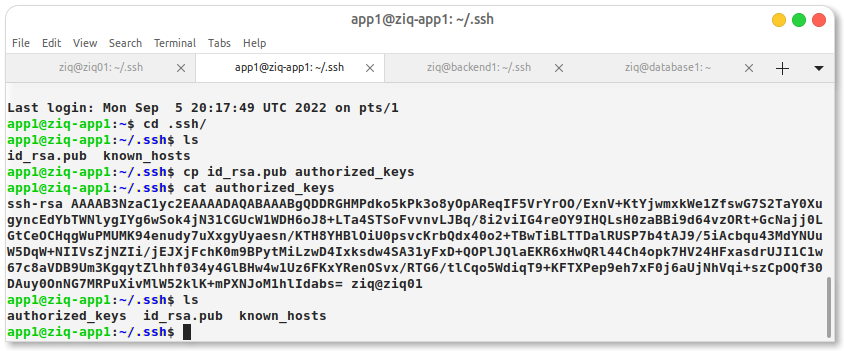
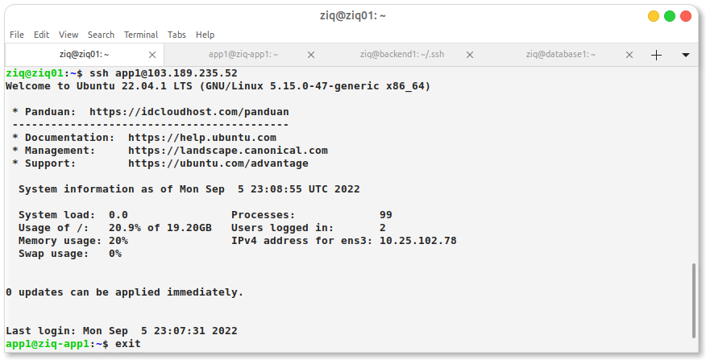
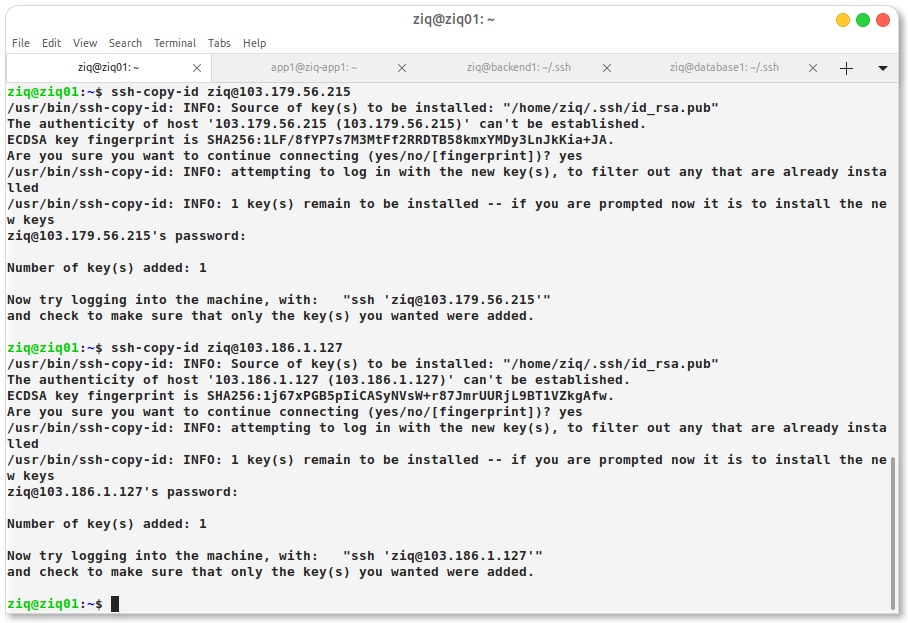

# Meremote ssh menggunnakan scp -r

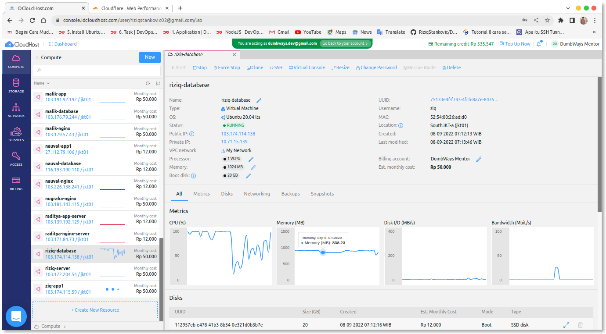

# 2. installation database mysql/mariadb 
# Manage DataBase MYSQL 

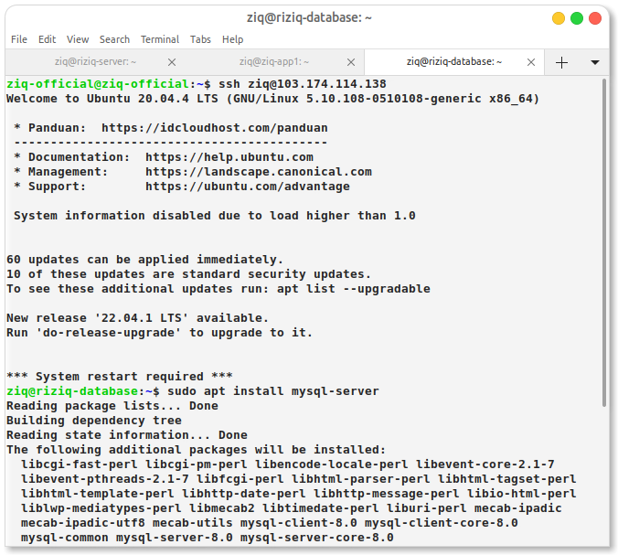
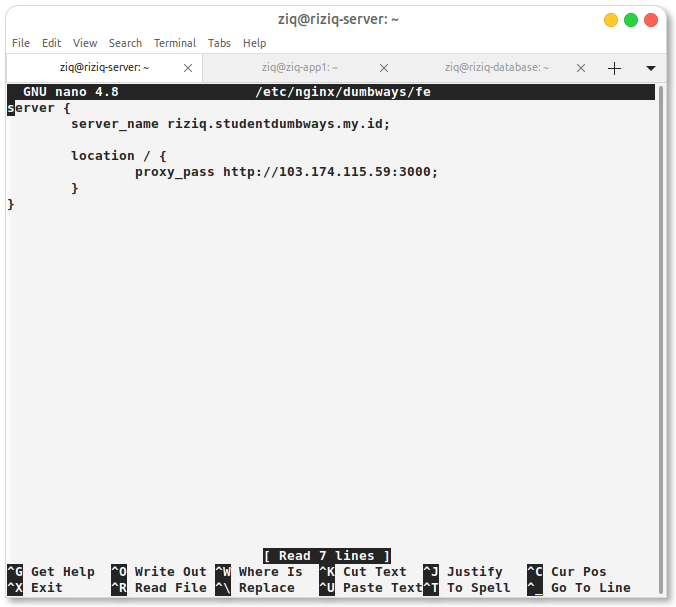

# 3. setup database , make user, privileges
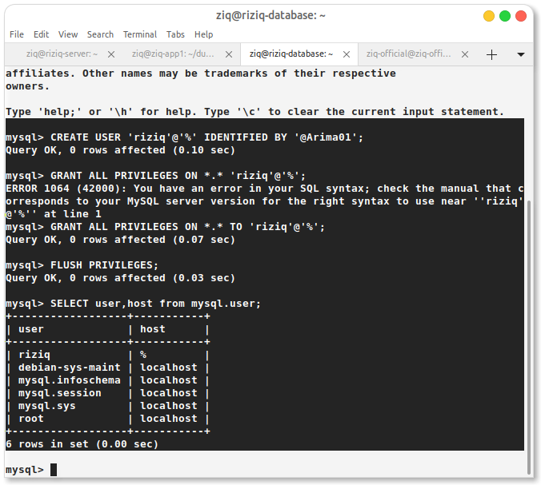
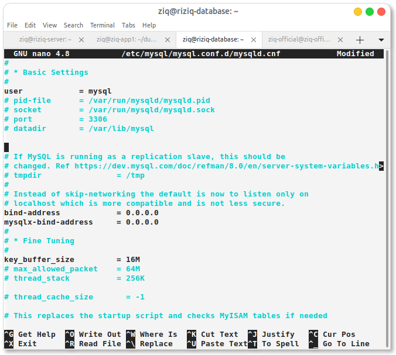
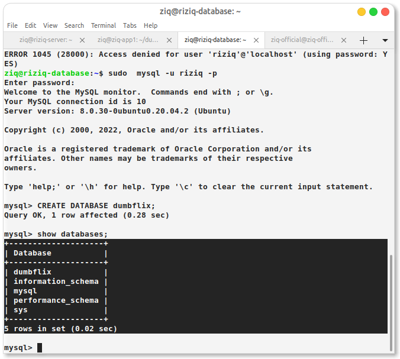
<!-- 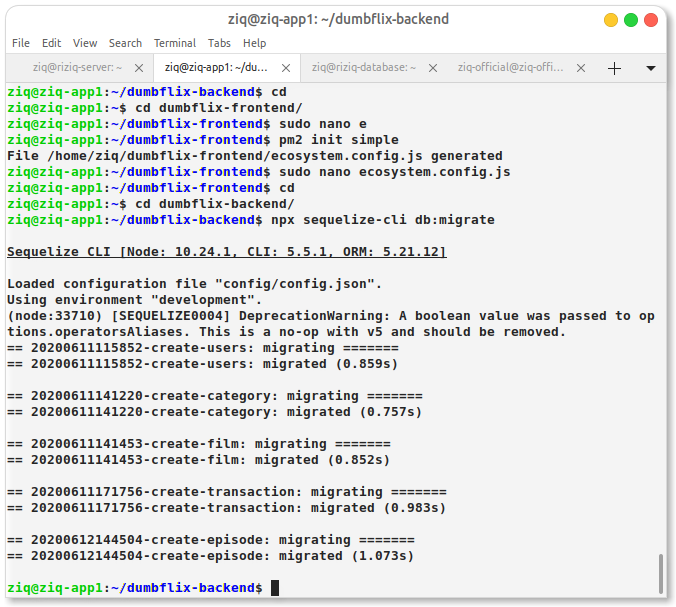 -->
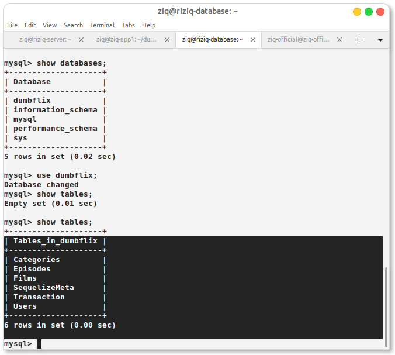

# Migrate DataBase

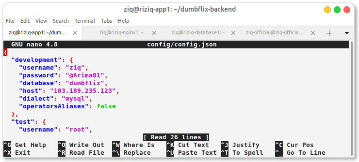
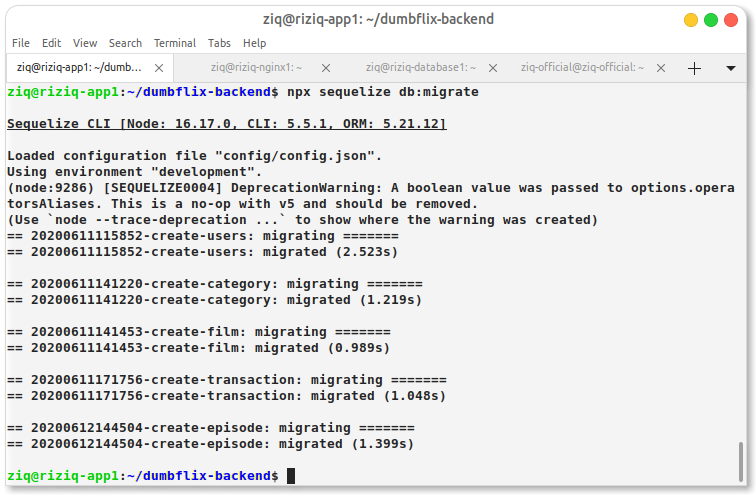
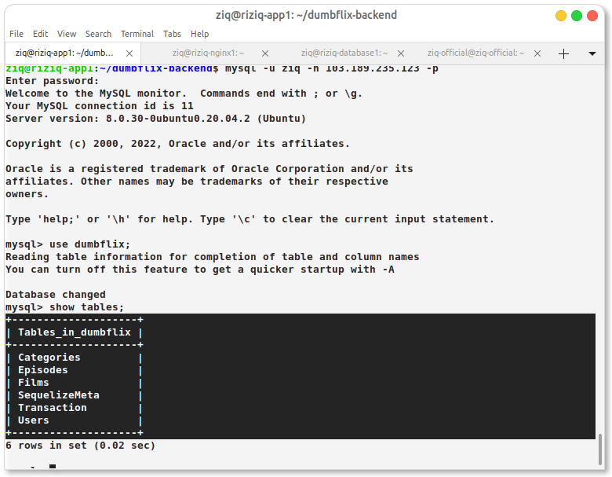

# Install MYSQL-Client

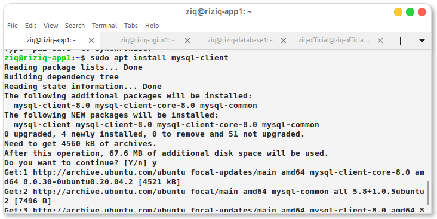
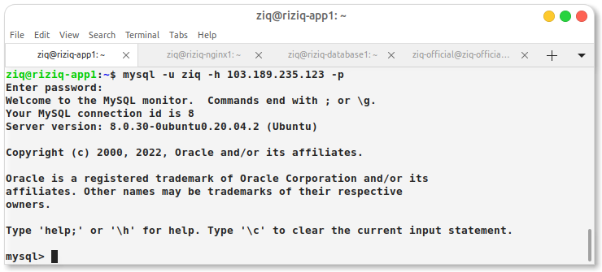
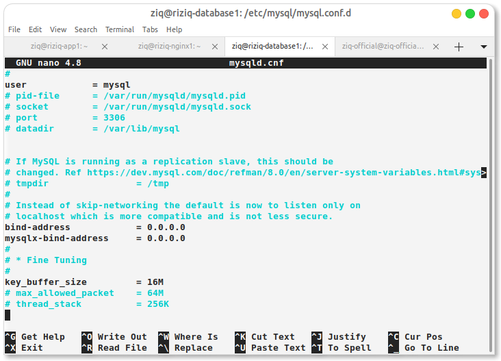
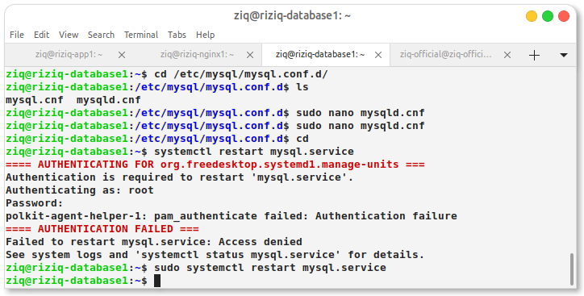

# 4. setup app backend (integration to database, reverse prxy, and multilevel domain )

# 5. integration frontend application with backend application (sampai bisa melakukan registrasi)

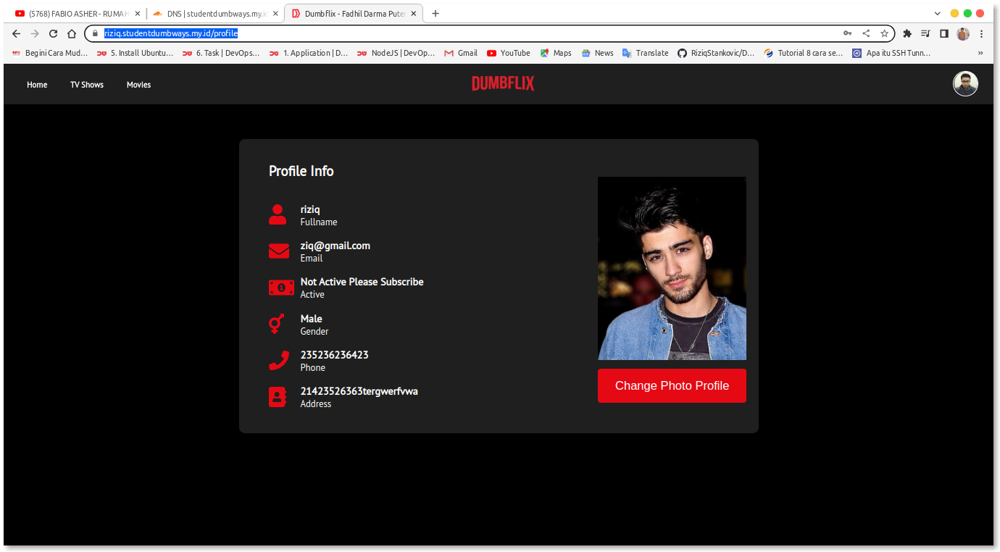

# Install SSL 

