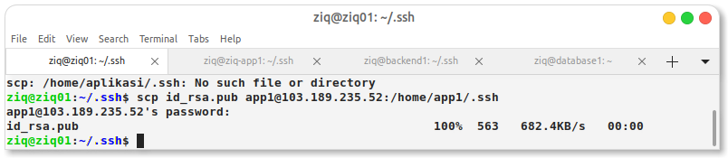
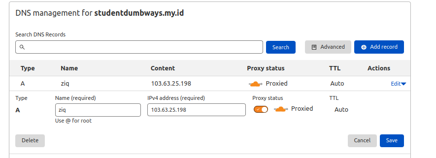

# Membuat server backend dan database menggunakan [IdCloudhost](https://console.idcloudhost.com/hub/login)

- Membuat Server di IDCH 


# 1. Setup ssh key antar server
# Generate SSH key and transfer ke smua ssh server


- masuk ke direktori ssh trus copy manual


- Langsung copas


- atau juga bisa menggunakan ssh-copy-id user@ip


# Meremote ssh menggunnakan scp

- Bisa juga menggunakan scp


```
scp -r .ssh user@ip:/
```



# 2. installation database mysql/mariadb 


<!-- 
 -->

# Manage DataBase MYSQL 
# 3. setup database , make user, privileges

<!--  -->

<!--  -->


# Install MYSQL-Client

- Sebelum instal mysql client configurasi mysqld terlebih dahulu untuk bisa bind ke jaringan lain


# 4. setup app backend (integration to database, reverse prxy, and multilevel domain )

<!--  -->


# Migrate DataBase


# 5. integration frontend application with backend application (sampai bisa melakukan registrasi)


<!--  -->


 


