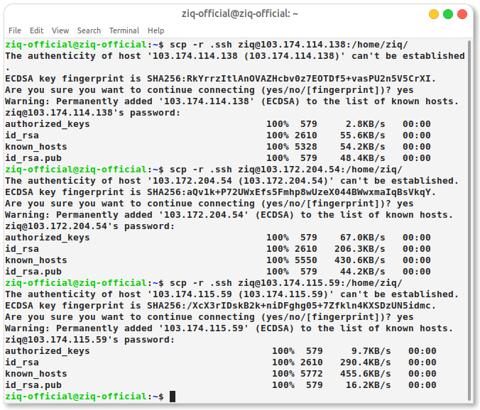

# Membuat server backend dan database menggunakan [IdCloudhost](https://console.idcloudhost.com/hub/login)

# 1. Setup ssh key antar server
# Generate SSH key and transfer ke smua ssh server

# Meremote ssh menggunnakan scp -r

# 2. installation database mysql/mariadb 
# Manage DataBase MYSQL 

# 3. setup database , make user, privileges

<!--  -->

# Migrate DataBase

# Install MYSQL-Client

# 4. setup app backend (integration to database, reverse prxy, and multilevel domain )

# 5. integration frontend application with backend application (sampai bisa melakukan registrasi)

# Install SSL 

