Minggu kemarin kita telah mempelajari deploy menggunakan system monolic yaitu system satu server. kali ini kita akan mempelajari tentang sedikit system sperti microservis dengan menggunakan docker 

TASK DAILY 

#  0. Buatlah script untuk installasi docker secara otomatis 

buat file baru nama bebas terus isikan link to install docker 
jikalau sudah jangan lupa untuk menambahkan hak izin akses menggunakn perintah


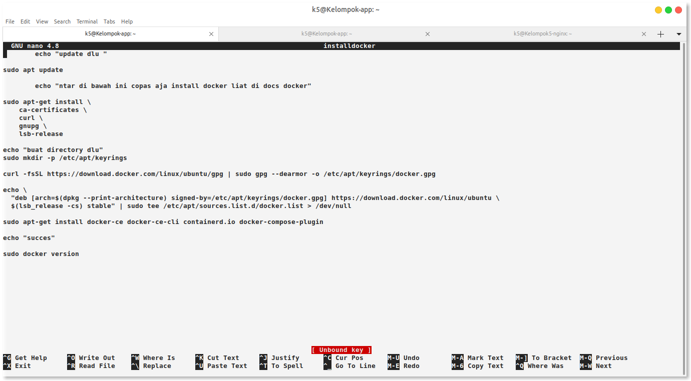

```
sudo chmod +x namafilenya
```
kemudian tinggal instal ./ dotslash

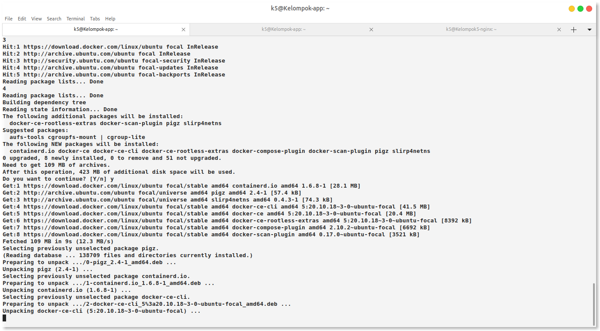

cek docker veresionya jikalau outputnya sama berarti berhasil

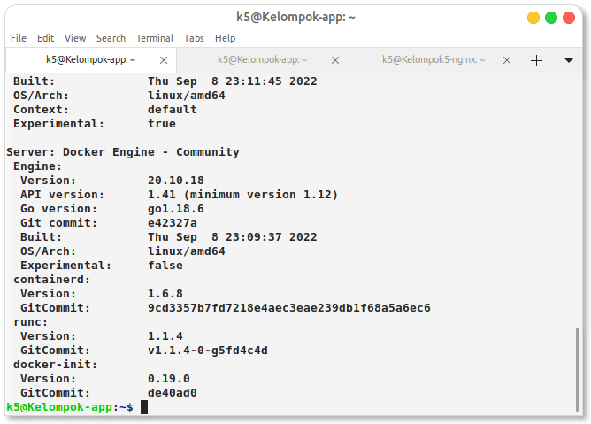


kemudian cek versinya

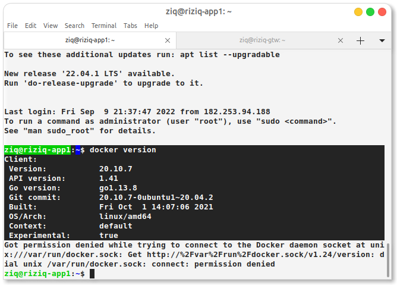


langsung kita beri akses untuk dockernya 
```
sudo usermod -aG docker nama-usernya
```
kmudian logou dan login lagi untuk melihatnya 


#  1. Deploy aplikasi dumbplay frontend backend on top docker (pakai docker-compose)

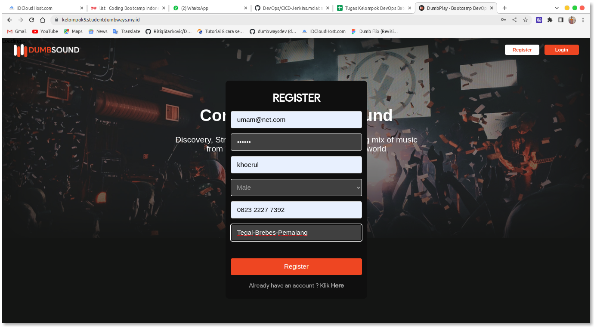

masuk ke direktori fe dan be kemudian setinga Dockerfilenya 

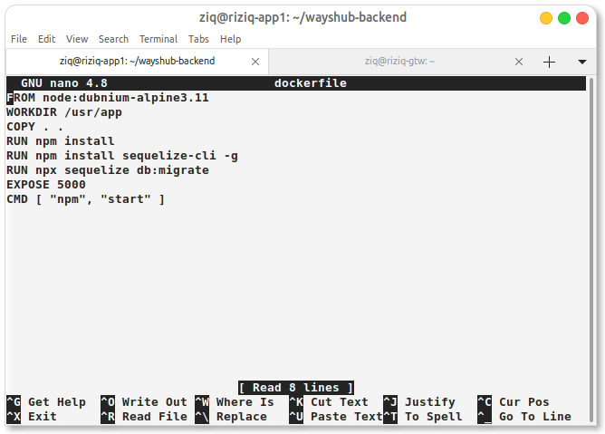

lalu build dengan 
```
docker build -t nama-imagennya . 
```

selanjutnya buat file yml utk docker compose membuat container dari image Dockerfile tadi '

masuk kedirektori fe atau terserah yg terpenting imagenya sudah terbuat kmudian buat config nya
 
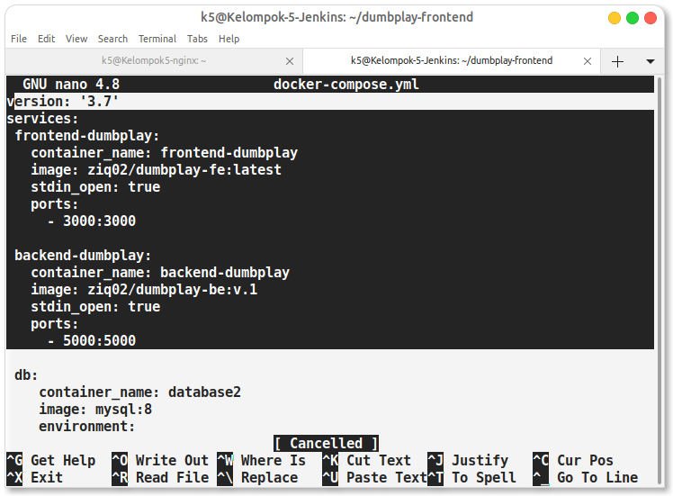


terus rebuild menggunakan docker compose 
```
docker compose up -d
```

cek menggunakan docker ps apakah sudah runiind sesuai dengan port nya 

jika sudah kmudian cek menggunakan ip app nya 

#  2. Buatlah docker-compose untuk deployment mysql (include untuk pembuatan user password dan juga  database)

disini saya menginstall mysql lngsung menggunakan docker run yng sebelumnya sudah diambil pull mysql dari web-docker 

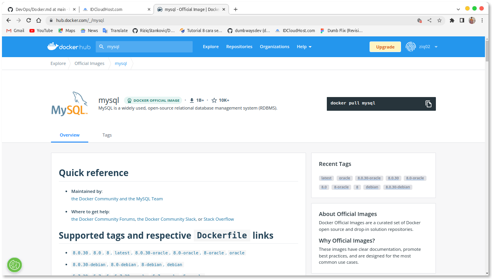
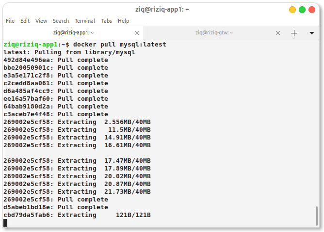


saya juga menggunakan docker compose untuk mysql sblumnya saya jadikan satu tpi khsus untuk database saya pisahkan terlebih dahulu 

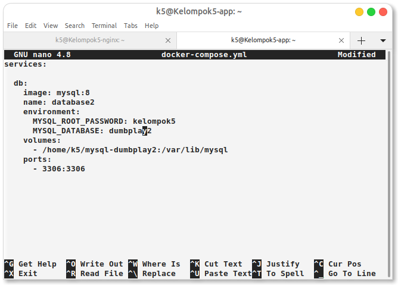

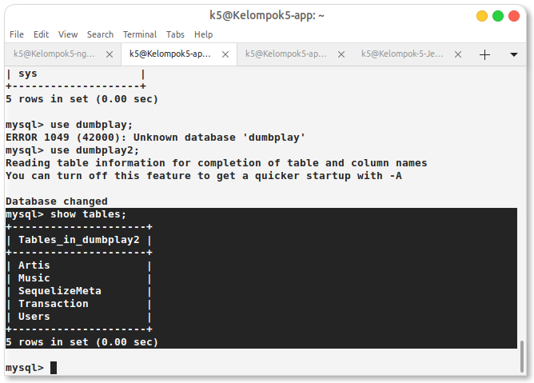


caranya buatt file docker-compose.yml dengn yaml jan lupa kmudian isi sesuai dengan yg akan di build sertakan kecockan congurasinya seperti image trus include environment juga 


jikalau sudah langsung kita up atau jadikan container untuk bisa running 
```
docker-compose up -d
```

kmudian cek di docker container ls

#  3. reverse proxy for frontend and backend application kelompok5.studentdumbways.my.id dan api.kelompok5.studentdumbways.my.id

pada bagian ini saya set up server nginx terlebih dahulu menggunakan reverse proxy dengan subdomain cloudflare kmudian untuk baggian backend saya menggunakn ssl dari wildcard yaitu dengan sertbot
``` 
sudo snap install core; sudo snap refresh core
sudo snap install --classic certbot
sudo certbot
```


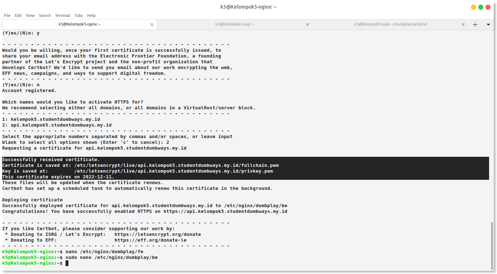


#  4. aplikasi bisa melakukan registrasi

kmudian saya set up lagi di bagian frontend untuk bisa terintegrai kan dengan api key antara fe dan be 
masuk app frontend/src/config/API.JS set up configurasikan dengan domain api backend

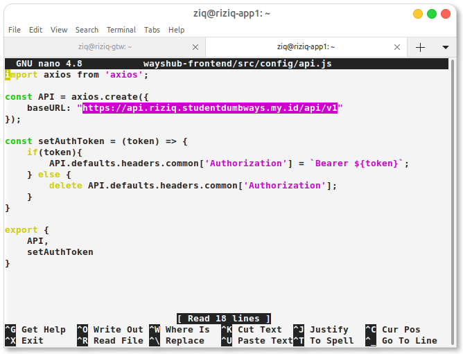

jikalau sudah kita bisa mengecek nya lgsung dengan sub domain api.kelompok5.studentdummbwyas.my.id

kmudian cek langsung di aplikasi nya kmudian registry dan juag login


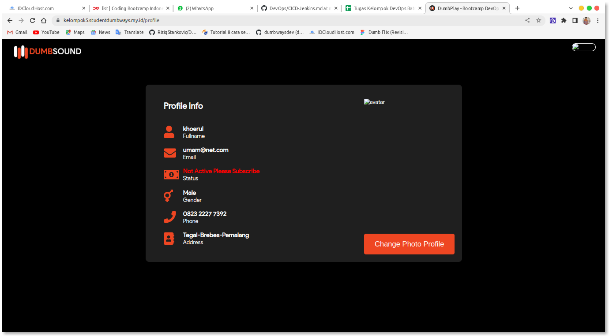
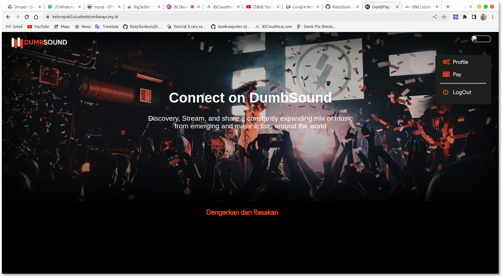

#  5. images kalian simpan kedalam hub.docker kalian masing"

caranya cukup mudah pastikan semua sudah cocok dengan yang akan di push meliputi nama repo dari docker hub ke nama images di dockernya harus sama nama usernya/tagnya jikalau blom saya bakall dipastikan erorr
kmudian tinggal kita push


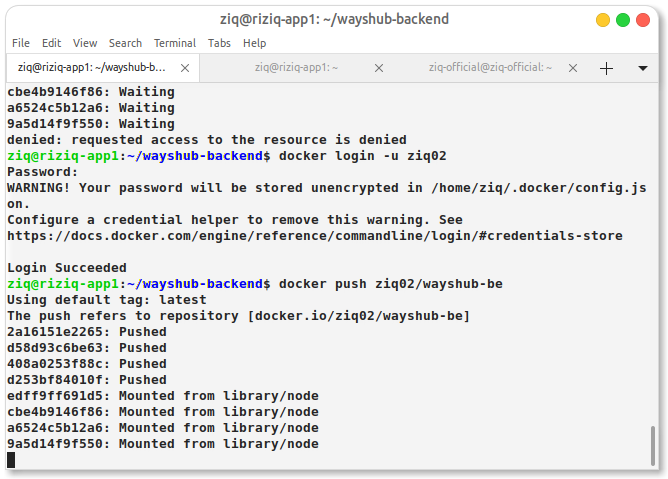
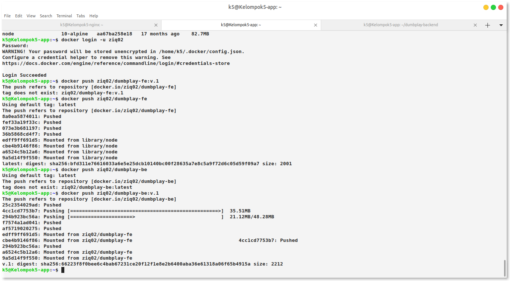

```
docker push imagenya(user/tagimagenya)
```
sblum push jan lupa login yak

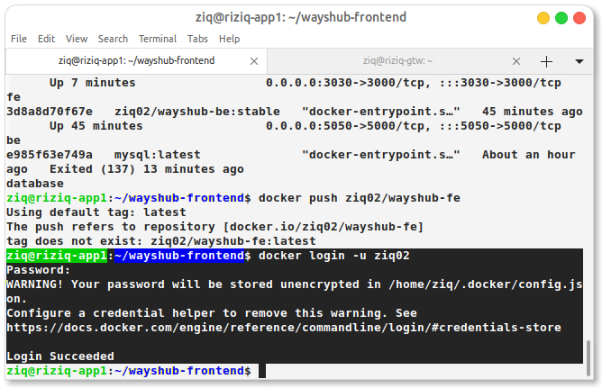


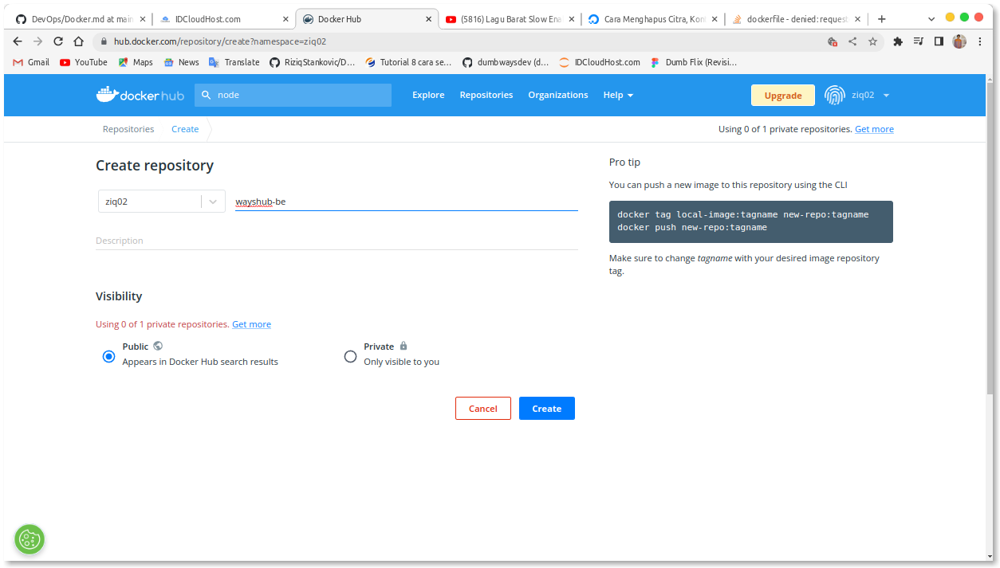
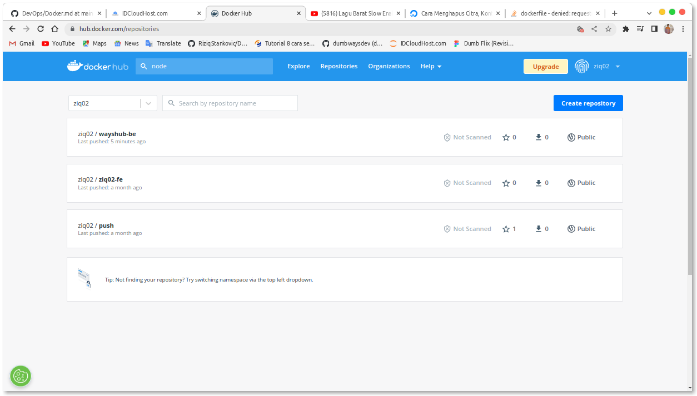
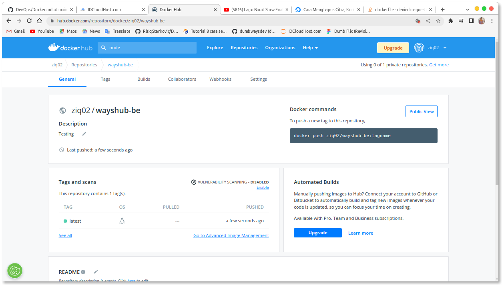

if you all seccesfully from the step by step and than you can save your image to the your repository in docker.hub repo but before u push you must configurate your account and your repository so you can be push without error and then thank u so much. 
