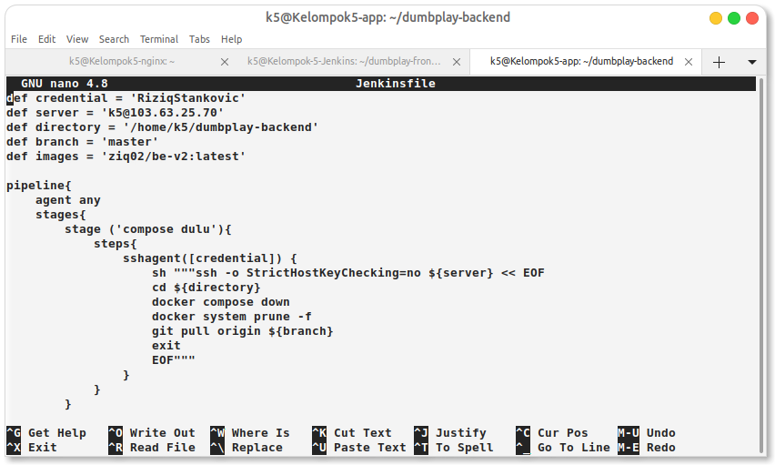
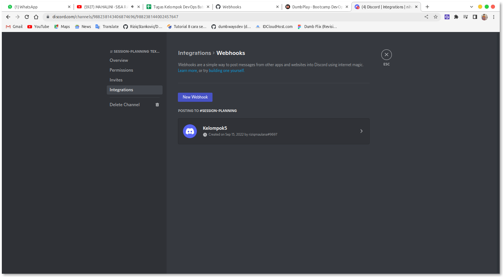

# 1. Install Jenkins on top docker (ssh agent plugin) ,(settup ssh key di dalam credential)

# 2. Create script for cicd (git pull --> build --> jalankan --> push images ke registry) untuk frontend dan backend

# Jenkinsfile fe

# Jenkinsfile be

kemudian kita push ke repo kita untuk bisa di baca oleh om jenkins

# Deploy CI/CD fe

# Deploy CI/CD be

# 3. Reverse proxy Jenkins jenkins.kelompok5.studentdumbways.my.id

Configurasi Reverse Proxynya di Server Nginx

# 4. Pasang Webhook kedalam repository github kalian (url/github-webhook)

Configurasi Webhook dengan discord di setting-gitrep/webhook add webhook kmudian dapatkan url di discord

buat channel kita sendiri kmudian lakukan integrasi di bgian setting channelnya lalu copy dan paste di url git repo nya.

gmabar Git di Phone

# 5. Jenkins Job Notification (slack, discord, telegram)

cara ini cukup simple kita tinggal menanbahkan script stage di dalam Jenkinsfile dari genererate syntax jenkins yang terdapat url dari discord untuk bisa mengirimakan notif, sebelumnya  kita install pugi terlebih dahulu khusus untuk discord kmudian lgusng kita edit file jenkins nya

lansung deploy

ss Di phone 

