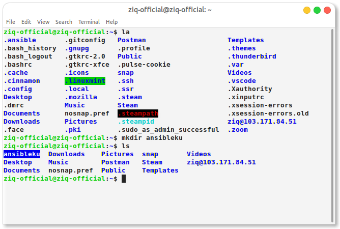

# 0. server 1cpu 2mem (exporter, promehteus, grafana) 

definisi
Ansible merupakan salah satu alat open source yang digunakan untuk mengotomasi proses setup yang dilakukan secara berulang pada banyak server menjadi sekali proses saja.

monitoring adalah program dimana mengvisualissasikan performa atau kinerja dari suatu server menjadi layanan visual.


Pertama sebelum kita melakukan monitoring kita membuat server terlebih dahulu, disin saya menggunakan satu server saja 


# 1. Install Ansible





# 2. Create user dengan nama kalian


```
- hosts: 'DevOpsMonitoring'
  gather_facts: no
  become: true
  vars:
    name:
  tasks:
       - name: 'Membuat User'
         user:
           name: riziq
           password: $6$NeGscLr8$TMTc2lNbjT0W8EL1oYL/.BPtVRgEi3kmkJ.l9RuhmT3VnGJXOGuiCLnS/7oMcZpEuHsSevyJbdx3l8GxfZ1.n0
           groups: sudo
           shell: /bin/bash
           system: no
           createhome: yes
           home: /home/riziq

       - name: 'Merubah Passwd Authen'
         lineinfile:
           path: /etc/ssh/sshd_config
           regexp: 'PasswordAuthentication no'
           line: PasswordAuthentication yes
          
       - name: 'Mengulang system sshd'
         systemd:
           name: sshd
           state: reloaded
```


# 3. install nginx and Docker using ansible


nginx
```
- hosts: DevOpsMonitoring
  become: yes
  gather_facts: yes
  tasks:
        - name: 'install nginx'
          apt: 
            name:
             - nginx
            state: latest
```


docker
```
- hosts: 'DevOpsMonitoring'
  become: yes
  gather_facts: yes
  tasks:
         - name: 'update'
           apt:
            update_cache: yes

         - name: 'upgrade'
           apt:
            upgrade: dist


         - name: 'install dependencies'
           apt:
             name:
             - ca-certificates
             - curl
             - gnupg
             - lsb-release

         - name: 'add docker gpg key'
           apt_key:
            url: https://download.docker.com/linux/ubuntu/gpg

         - name: 'add repository docker'
           apt_repository:
             repo: deb  https://download.docker.com/linux/ubuntu focal stable

         - name: 'install docker engine'
           apt: 
            name:
             - docker-ce
             - docker-ce-cli
             - containerd.io
             - docker-compose-plugin

         - name: 'update'
           apt:
            update_cache: yes

         - name: 'install docker-compose'
           shell: curl -SL https://github.com/docker/compose/releases/download/v2.6.0/docker-compose-linux-x86_64 -o /usr/local/bin/docker-compose


         - name: 'set permision for docker'
           shell: sudo chmod +x /usr/local/bin/docker-compose
        
         - name: 'docker without sudo'
           shell: sudo usermod -aG docker ziq


```


# 4. Install Monitoring using ansible on top docker


ansible monitoring prometheus & grfana

```
- hosts: 'DevOpsMonitoring'
  become: yes
  gather_facts: yes
  vars:
    name:
  tasks:
       - name: 'update'
         apt:
          update_cache: yes

       - name: 'upgrade'
         apt:
          upgrade: dist

       - name: 'Docker Run Node Exporter'
         shell: docker run -d --net="host" --pid="host" -v "/:/host:ro,rslave" --name node_exporter quay.io/prometheus/node-exporter --path.rootfs=/host

       - name: "Create a directory if it does not exist"
         ansible.builtin.file:
           path: /home/ziq/prometheus
           state: directory

       - name: 'Copy Configuration Prometheus'
         copy:
           src: /home/ziq-official/ansibleku/prometheus.yml
           dest: /home/ziq/prometheus
        
       - name: 'install python docker'
         shell: sudo apt install python3-docker -y


      #  - name: 'Login DockerHub'
      #     docker_login:
      #      username: {username}
      #      password: {password}

       - name: 'Stage 1 Pull image Prometheus'
         docker_image:
           name: bitnami/prometheus
           source: pull

       - name: 'Container Start Prometheus'
         docker_container:
           name: prometheus
           image: bitnami/prometheus
           ports:
             - 9090:9090
           volumes: /home/ziq/prometheus:/etc/prometheus

       - name: 'Stage 2 Pull image Grafana'
         docker_image:
           name: grafana/grafana    
           source: pull

       - name: 'Container Start Grafana'
         docker_container:
           name: grafana
           image: grafana/grafana
           ports:
             - 3000:3000
```


# 5. challange (monitoring specific container)


```
sudo docker run -d -p 8083:8083 -p 8086:8086 --expose 8090 --expose 8099 --name influxsrv tutum/influxdb

```
```
sudo docker run --volume=/:/rootfs:ro --volume=/var/run:/var/run:rw --volume=/sys:/sys:ro --volume=/var/lib/docker/:/var/lib/docker:ro --publish=8080:8080 --detach=true --link influxsrv:influxsrv --name=cadvisor google/cadvisor:latest -storage_driver_db=influxdb -storage_driver_host=influxsrv:8086
```

```
sudo docker run -d -p 3000:3000 -e INFLUXDB_HOST=localhost -e INFLUXDB_PORT=8086 -e INFLUXDB_NAME=cadvisor -e INFLUXDB_USER=root -e INFLUXDB_PASS=root --link influxsrv:influxsrv --name grafana grafana/grafana

```


untuk mengecek apakah sudah run apa blom

```
docker ps -a
```

# 6. make reverse proxy with ansible 


```
  - hosts: DevOpsMonitoring
    roles:
      - hispanico.nginx_revproxy
    vars:
      nginx_revproxy_sites:
        default:
          ssl: false
          letsencrypt: false

        ziq.studentdumbways.my.id:
          domains:
            - cadvisor.ziq.studentdumbways.my.id
          upstreams:
            - { backend_address: 103.134.154.254, backend_port: 8080 }
          ssl: true
          letsencrypt: false
```


   # - node-exporter.name.studentdumbways.my.id (node exporter)


   # - prometheus.ziq.studentdumbways.my.id (promehteus)


  
   # - dashboard.ziq.studentdumbways.my.id  (grafana)


