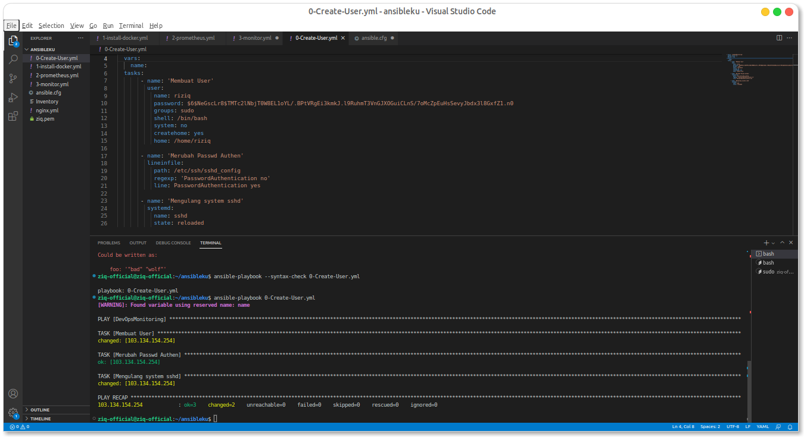
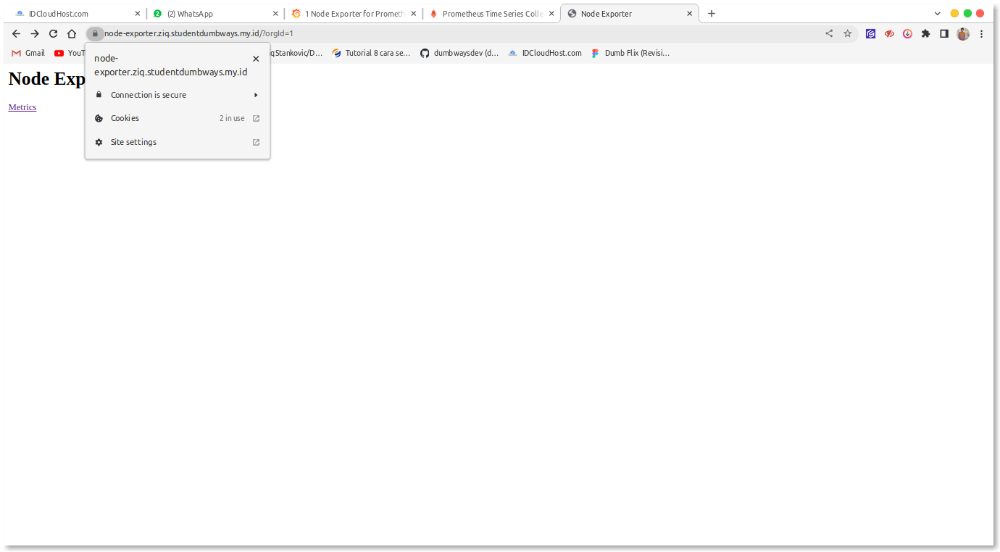

# 0. server 1cpu 2mem (exporter, promehteus, grafana) 

definisi
Ansible merupakan salah satu alat open source yang digunakan untuk mengotomasi proses setup yang dilakukan secara berulang pada banyak server menjadi sekali proses saja.

monitoring adalah program dimana mengvisualissasikan performa atau kinerja dari suatu server menjadi layanan visual.


Pertama sebelum kita melakukan monitoring kita membuat server terlebih dahulu, disin saya menggunakan satu server saja 


# 1. Install Ansible


# 2. Create user dengan nama kalian




# 3. install nginx and Docker using ansible


# 4. Install Monitoring using ansible on top docker


# 5. challange (monitoring specific container)


```
sudo docker run -d -p 8083:8083 -p 8086:8086 --expose 8090 --expose 8099 --name influxsrv tutum/influxdb

```
```
sudo docker run --volume=/:/rootfs:ro --volume=/var/run:/var/run:rw --volume=/sys:/sys:ro --volume=/var/lib/docker/:/var/lib/docker:ro --publish=8080:8080 --detach=true --link influxsrv:influxsrv --name=cadvisor google/cadvisor:latest -storage_driver_db=influxdb -storage_driver_host=influxsrv:8086
```

```
sudo docker run -d -p 3000:3000 -e INFLUXDB_HOST=localhost -e INFLUXDB_PORT=8086 -e INFLUXDB_NAME=cadvisor -e INFLUXDB_USER=root -e INFLUXDB_PASS=root --link influxsrv:influxsrv --name grafana grafana/grafana

```


untuk mengecek apakah sudah run apa blom

```
docker ps -a
```

# 6. make reverse proxy with ansible 


   # - node-exporter.name.studentdumbways.my.id (node exporter)




   # - prometheus.ziq.studentdumbways.my.id (promehteus)


  
   # - dashboard.ziq.studentdumbways.my.id  (grafana)


