# KUBERNETES

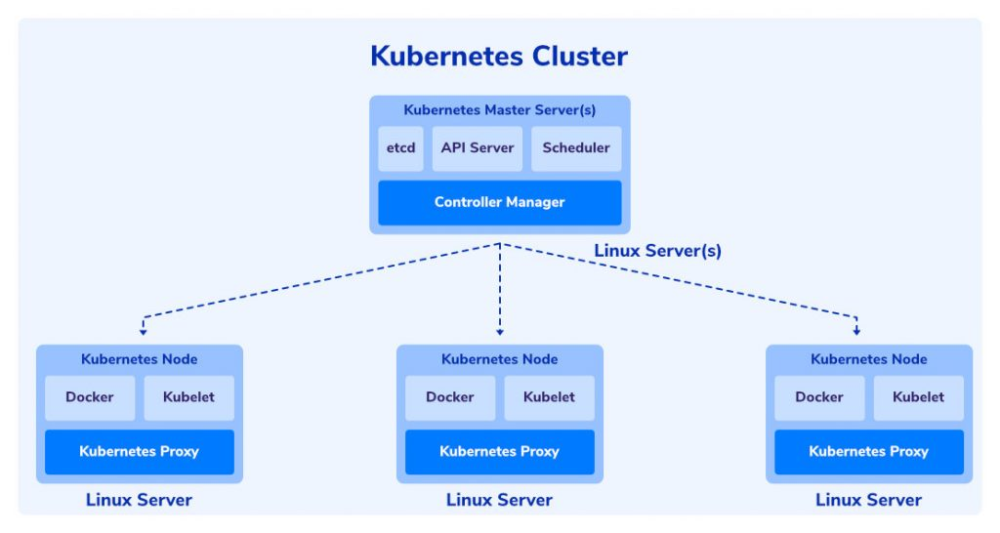

Master Node
Master node adalah server utama yang mengatur semua operasi cluster menggunakan tiga komponen, yaitu kube-apiserver, kube-controller-manager, kube-scheduler dan etcd.

Di bawah ini adalah penjelasan fungsinya:

kube-apiserver: validasi dan konfigurasi data untuk objek API, yaitu pod, services, volume, dan lainnya.
kube- controller-manager: melakukan monitor cluster agar sesuai dengan konfigurasi data objek di dalam node.  
kube-scheduler: menambah objek baru ke node. Misalnya, menginstall pod ke node tertentu.
Etcd: ruang penyimpanan key value konfigurasi data cluster.
Worker Node
Worker node adalah semua server non master yang berfungsi untuk menjalankan dua komponen, yaitu kubelet dan kube-proxy. Begini penjelasan fungsi komponennya:

Kubelet: komponen untuk memastikan kontainer beroperasi di dalam objek Pod.
Kube-proxy: memelihara network rules dan meneruskan koneksi ke suatu host.
Docker image: file dari aplikasi Docker yang berfungsi untuk membuat kontainer. 

# Kubernetes Installation


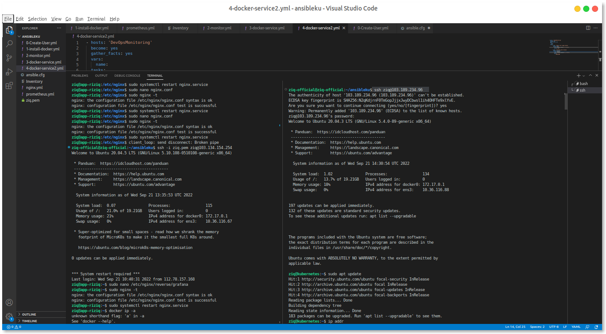
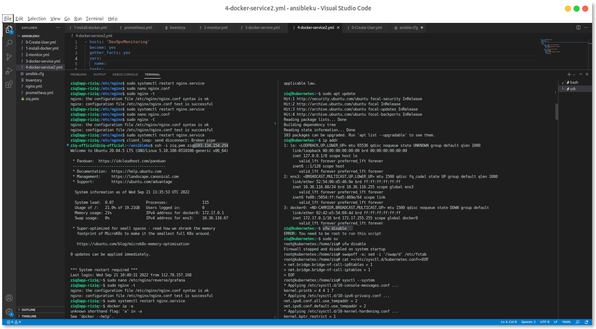
```
ufw disable
```

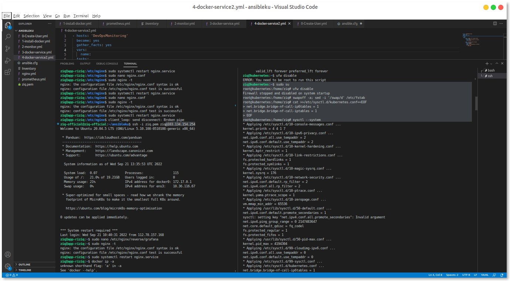
```
swapoff -a; sed -i '/swap/d' /etc/fstab
```
```
cat >>/etc/sysctl.d/kubernetes.conf<<EOF
net.bridge.bridge-nf-call-ip6tables = 1
net.bridge.bridge-nf-call-iptables = 1
EOF
```
```
sysctl --system
```

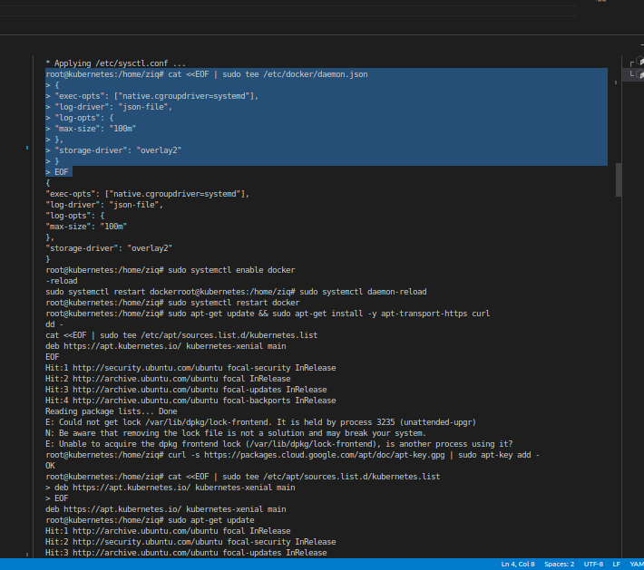
```
cat <<EOF | sudo tee /etc/docker/daemon.json
{
"exec-opts": ["native.cgroupdriver=systemd"],
"log-driver": "json-file",
"log-opts": {
"max-size": "100m"
},
"storage-driver": "overlay2"
}
EOF
```

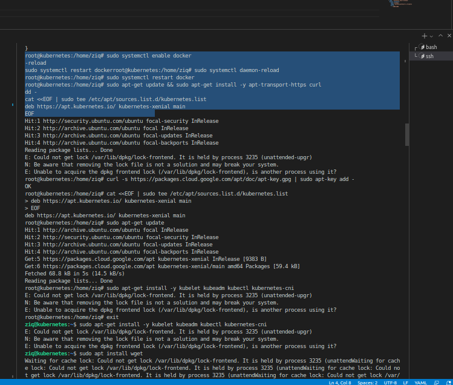
```
sudo systemctl enable docker
sudo systemctl daemon-reload
sudo systemctl restart docker
```
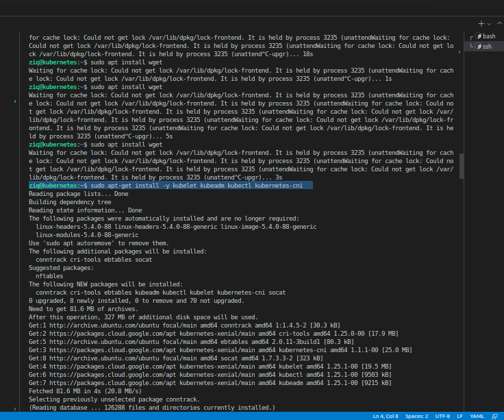
```
sudo apt-get update && sudo apt-get install -y apt-transport-https curl
curl -s https://packages.cloud.google.com/apt/doc/apt-key.gpg | sudo apt-key add -
cat <<EOF | sudo tee /etc/apt/sources.list.d/kubernetes.list
deb https://apt.kubernetes.io/ kubernetes-xenial main
EOF
sudo apt-get update
```
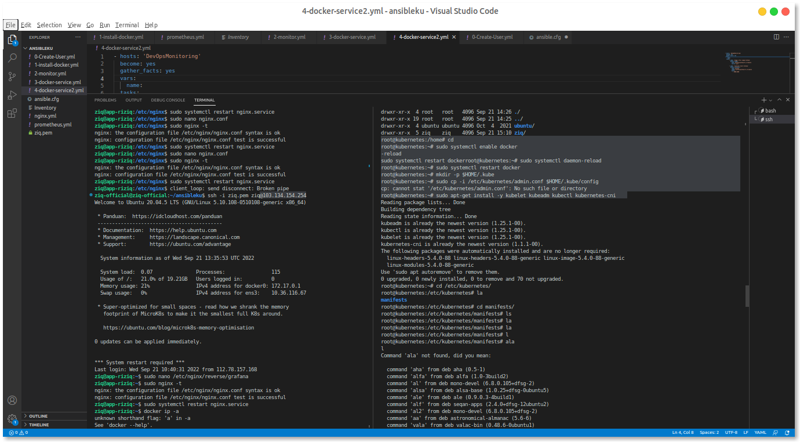
```
sudo apt-get install -y kubelet kubeadm kubectl kubernetes-cni
```
```
sudo systemctl daemon-reload
sudo systemctl restart kubelet
```
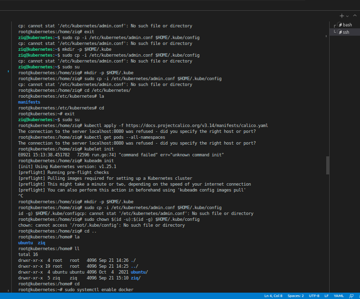
```
kubeadm init
```
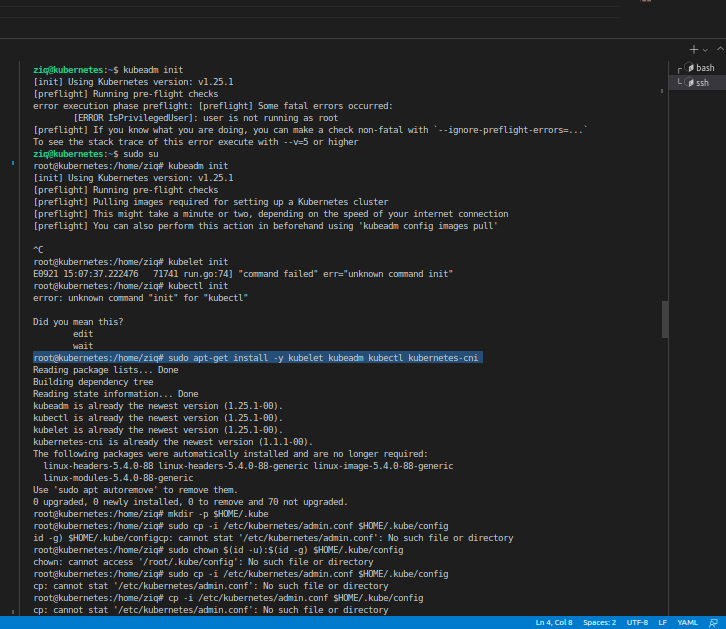
```
mkdir -p $HOME/.kube
sudo cp -i /etc/kubernetes/admin.conf $HOME/.kube/config
sudo chown $(id -u):$(id -g) $HOME/.kube/config
```

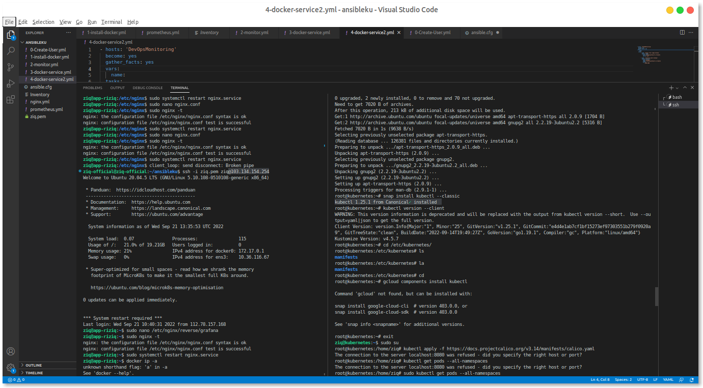
```
kubectl apply -f https://raw.githubusercontent.com/projectcalico/calico/v3.24.1/manifests/calicoctl-etcd.yaml

```


```
kubectl get pods --all-namespaces
```
```
kubeadm token create --print-join-command
```
```
kubectl get nodes
```
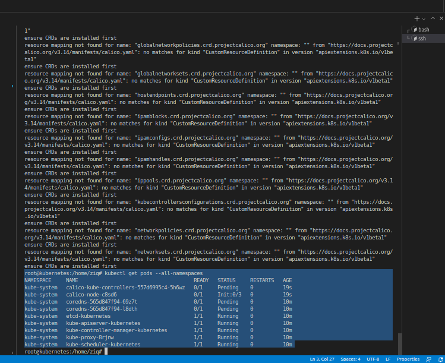
```

```

# Deploy Nginx

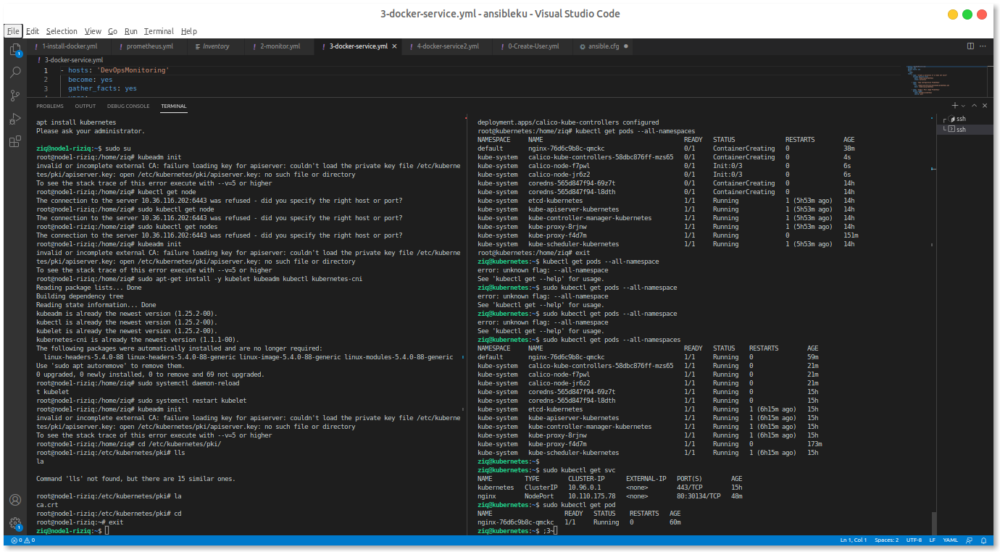


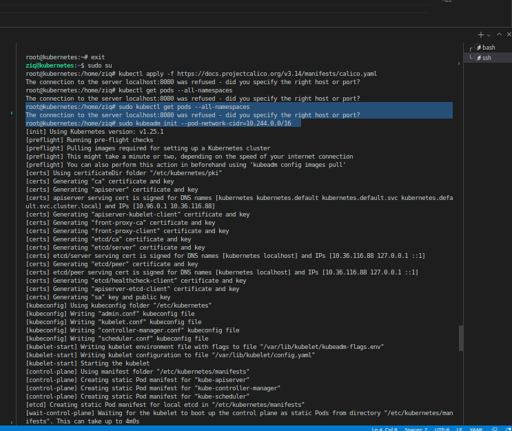
```
kubectl create deploy nginx --image nginx
```
```
kubectl expose deploy nginx --port 80 --type NodePort
```
```
kubectl get svc
```

```
kubectl describe pod nama pod
```

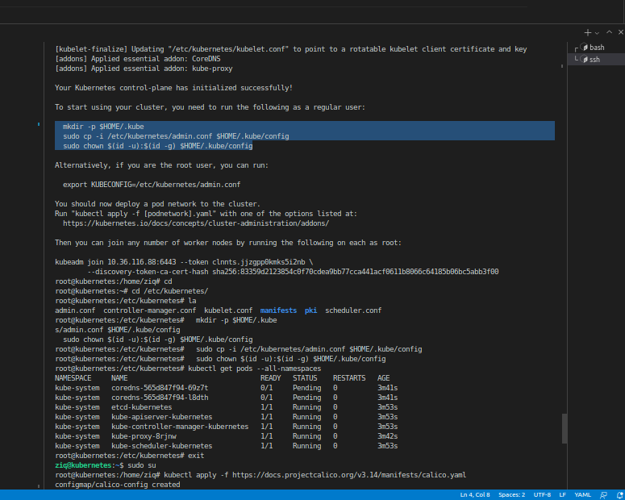


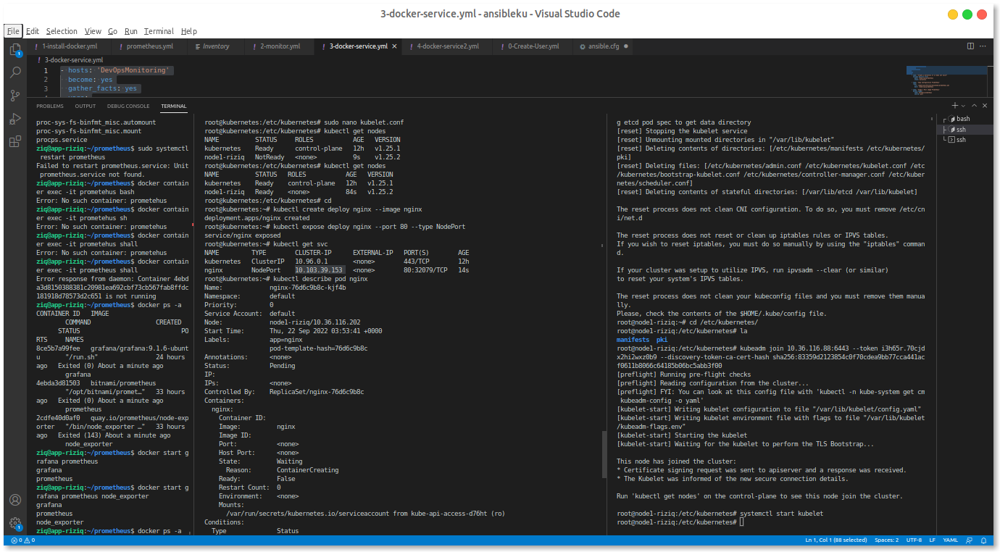


# Deploy App

disini saya akan deploy simple app micro services

```
git clone https://github.com/toolkeet/dumbways-docker-microservices.git
```

kmudian deploy masuk ke direc micro nya 

```
kubectl apply -f kubernetes.yml
```


berhasil namun masih terjadi erorr di scale nya 
note crashloop

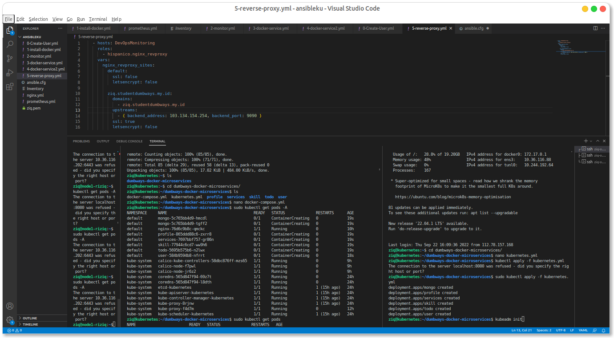


<!--  -->