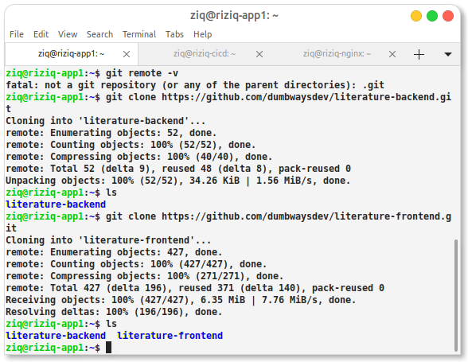
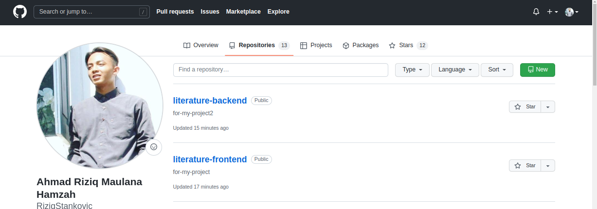
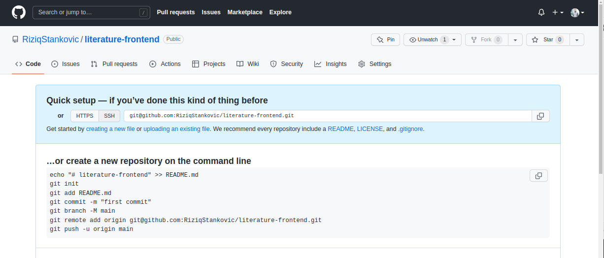
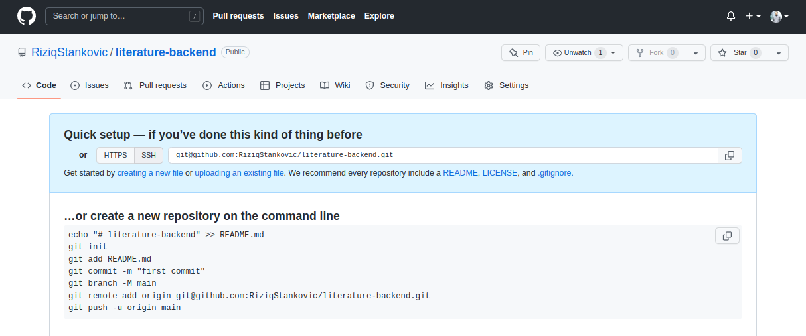
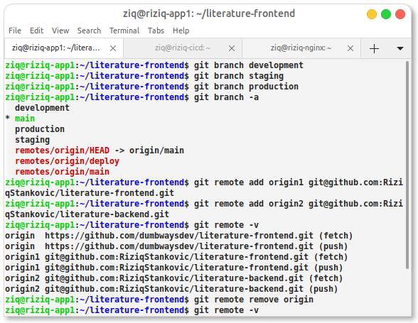

Pertama kita clone dulu aplikasi nya

 

Jikalau sudah kita buat branch nya sekaligus add remote url nya

branch development, staging, production

Set url kedalam repository kita sendiri

 

fe

 

be

 

kemudian cek

 

