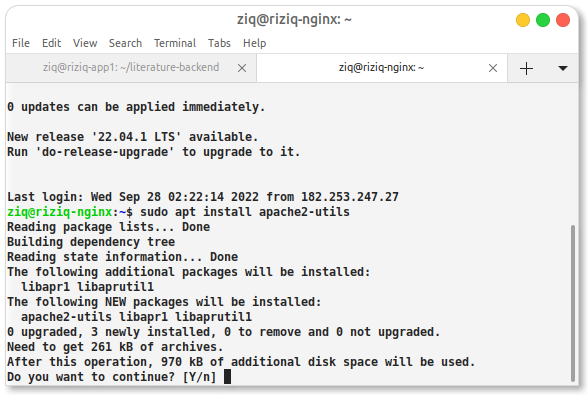
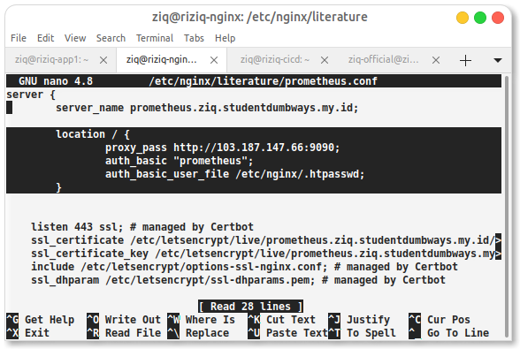
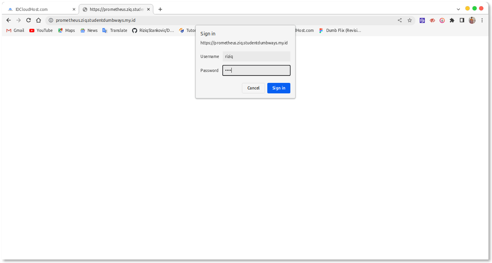

# Install and set up configurasinya




```
sudo htpasswd -c /etc/nginx/.htpasswd admin

```
outputnya masukan username dan passwd 
lalu set up di foldernya

```
sudo nano /etc/nginx/literature/prometheus.conf 
```





jan lupa configurate auth pass di grafana


