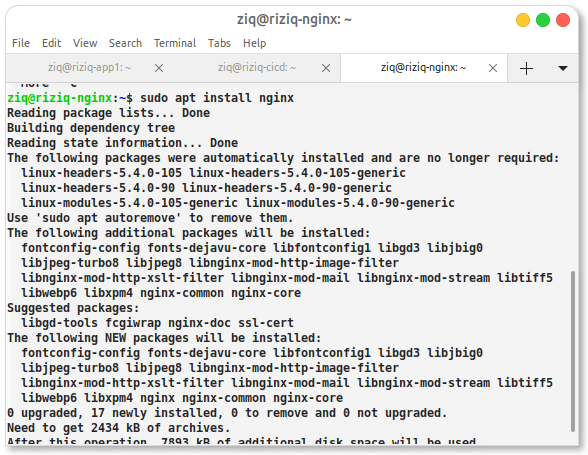
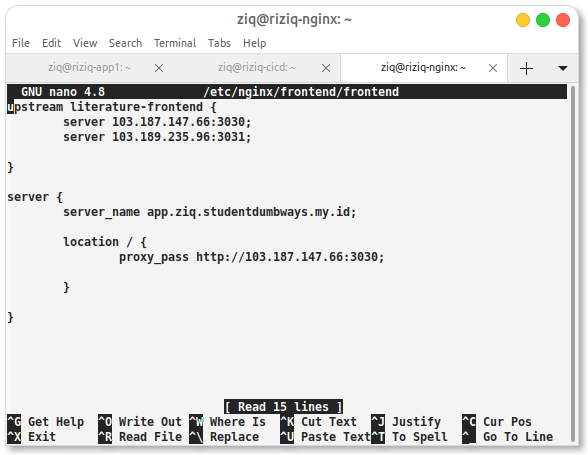
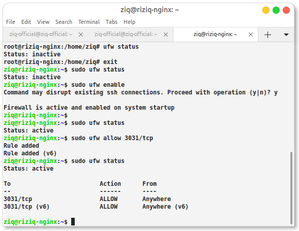
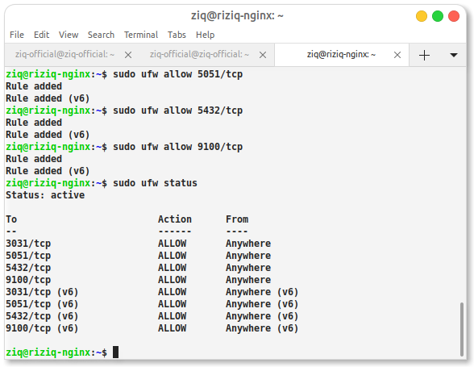

# Create Server

- Server App (Frontend & Backend) or (Frontend, Backend, Database), 2 Core 2 2Gb RAM with Server Monitoring
- Server Nginx, 1 Core 1Gb RAM
- Server CI/CD , 2 Core 2Gb RAM

Kita menggnakan platform vps dari idcloudhost. jikalau sudah kita install dan set up konfiguarsinya




# kemudian masuk dan konfigurasi load balancing server nya 


- FE



```
upstream literature-frontend {
        server 103.187.147.66:3030;
        server 103.189.235.96:3031;

}

server { 
        server_name app.ziq.studentdumbways.my.id;

        location / { 
                proxy_pass http://literature-frontend;

        }

}
```

- BE


```
upstream literature-backend {
        server 103.187.147.66:5050;
        server 103.189.235.96:5051;

}

server {
        server_name api.ziq.studentdumbways.my.id;

        location / {
                proxy_pass http://literature-backend;

        }

}

```

# Create Security with UFW (Uncomplicated Firewall)






