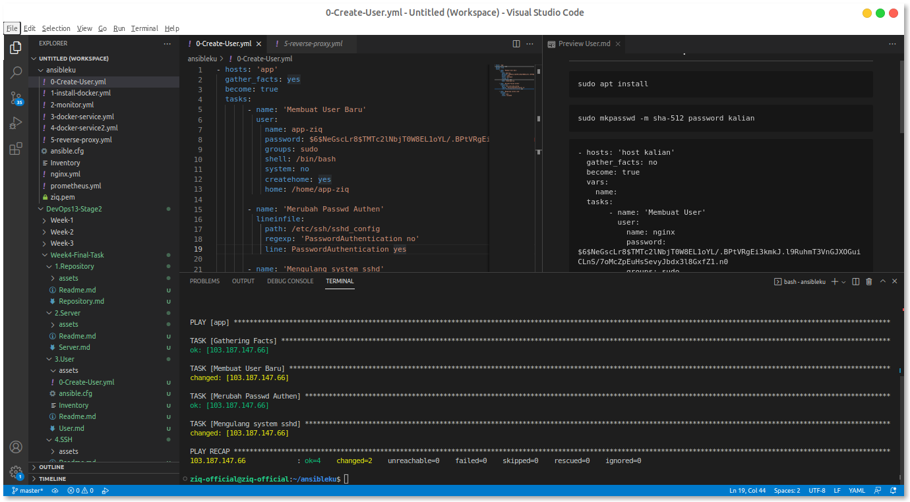
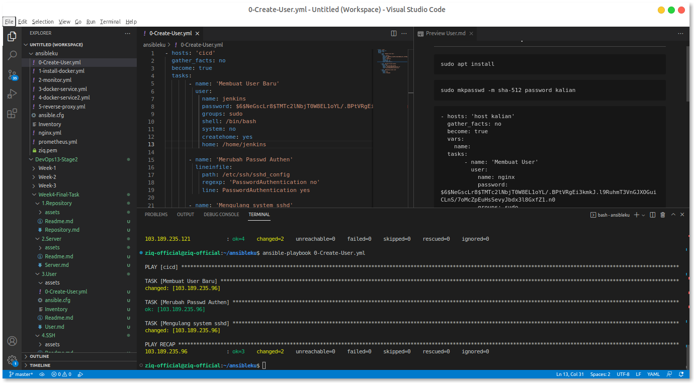

# Create user with password

```
sudo apt install whois
```

kemudian kita generate password
lalu masukan token kedalam script ansible nya


```
sudo mkpasswd -m sha-512 password kalian
```




```
- hosts: 'host kalian'
  gather_facts: no
  become: true
  vars:
    name:
  tasks:
       - name: 'Membuat User'
         user:
           name: nginx
           password: $6$NeGscLr8$TMTc2lNbjT0W8EL1oYL/.BPtVRgEi3kmkJ.l9RuhmT3VnGJXOGuiCLnS/7oMcZpEuHsSevyJbdx3l8GxfZ1.n0
           groups: sudo
           shell: /bin/bash
           system: no
           createhome: yes
           home: /home/nginx

       - name: 'Merubah Passwd Authen'
         lineinfile:
           path: /etc/ssh/sshd_config
           regexp: 'PasswordAuthentication no'
           line: PasswordAuthentication yes
          
       - name: 'Mengulang system sshd'
         systemd:
           name: sshd
           state: reloaded
```

set up inventory dan ansible.cfg

inventory

```
    [all]
    103.187.147.66 ansible_user=ziq
    103.189.235.121 ansible_user=ziq
    103.189.235.96 ansible_user=ziq

    [app]
    103.187.147.66 ansible_user=ziq

    [nginx]
    103.189.235.121 ansible_user=ziq

    [jenkins]
    103.189.235.96 ansible_user=ziq
```

ansible.cfg

```
[defaults]
inventory = Inventory
private_key_file = ziq.pem  #harus teliti dan aktif
```

```
scp -r user@ip:/home/usr/.ssh/nama-file ./destinati 
```

```
cat id_rsa >> ziq.pem
```

```
ansible-playbook namafile ymlnya
```

 

cek di server masing pasti sudah berhasil terbuat server