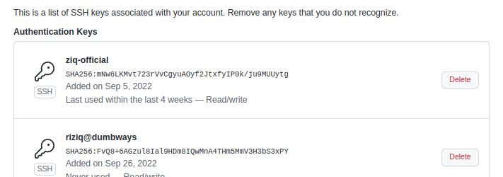

# Create ssh with your username


```
ssh-keygen -t -C "your_email"
```

otomatis akan ke generate sesuai username 


# ssh key connect all server with config


Contoh config

```
Host nginx
 Hostname 103.189.235.121
 User ziq

Host nginx2
 Hostname 103.189.235.121
 User nginx2

Host app
 Hostname 103.187.147.66
 User ziq

Host app2
 HOstname 103.187.147.66
 User app-ziq

```

# ssh connect with git and the same credential key for ci/cd Jenkins


kita masukan kedalam github dan juga credential cicd jenkinsya

ini cicd jjenkins


ini git 





ok done
