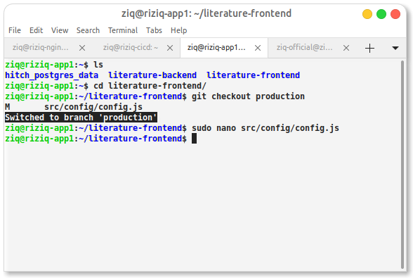
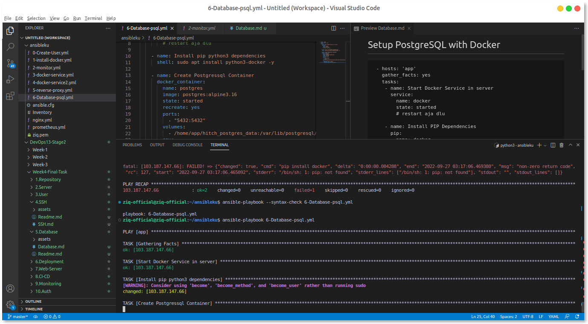
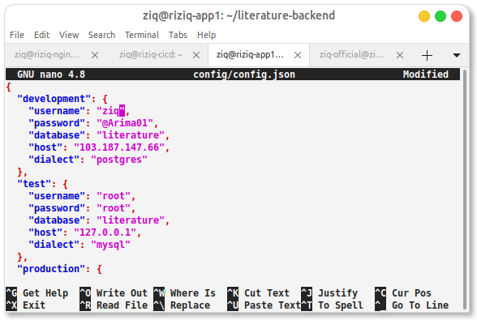
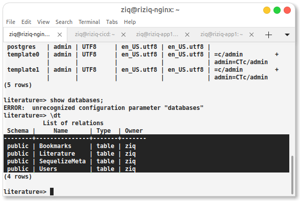
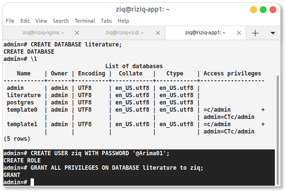
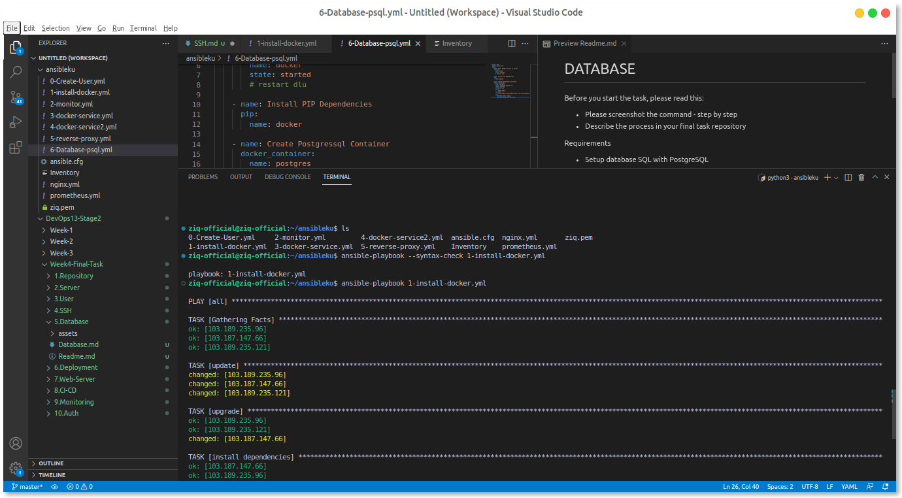
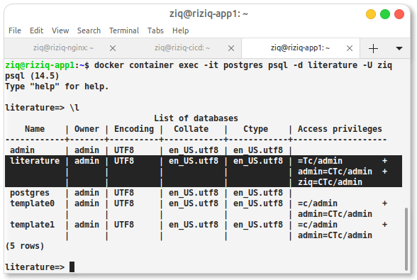
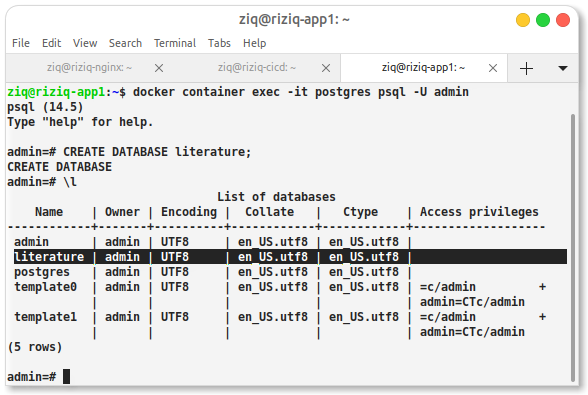
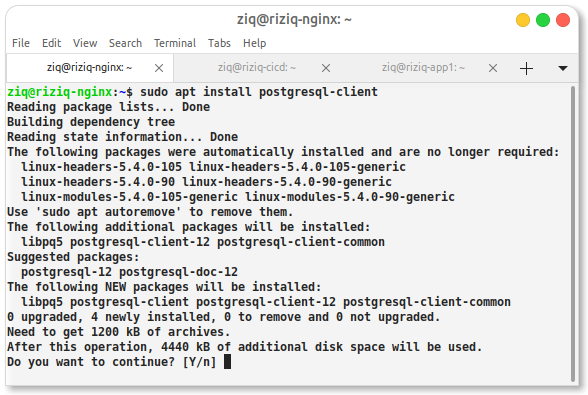
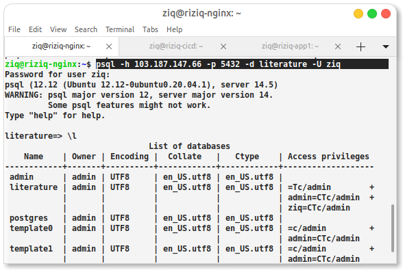

# Setup PostgreSQL with Docker

Pertama kita pindah dlu branch ke production



disini saya akan memasangnya menggunakan ansible biar lebih cepat dan mudah

cek ping dlu


```
 - hosts: 'app'
   gather_facts: yes
   tasks:
    - name: Start Docker Service in server
      service:
        name: docker
        state: started
        # restart aja dlu

    - name: Install pip python3 dependencies 
      shell: sudo apt install python3-docker -y
 
    - name: Create Postgressql Container
      docker_container:
        name: postgres
        image: postgres:alpine3.16
        state: started
        recreate: yes
        ports:
          - "5432:5432"
        volumes:
          - /home/ziq/hitch_postgres_data:/var/lib/postgresql/data
        env:
          POSTGRES_USER: "admin"
          POSTGRES_PASSWORD: "@Arima01"
```





kemmudian kita configurasikan 




lalu kita migrasikan dan koneksikan kedalam database 













kita runing di client untuk mengeceknya 

install psql client nya

```
sudo apt install postgresql-client
```



with command

```
psql -h iphost -p 5432 -d namadatabase -U nameusernnya
```



oke done