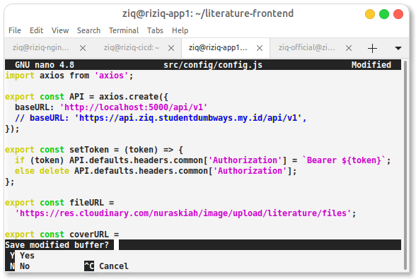
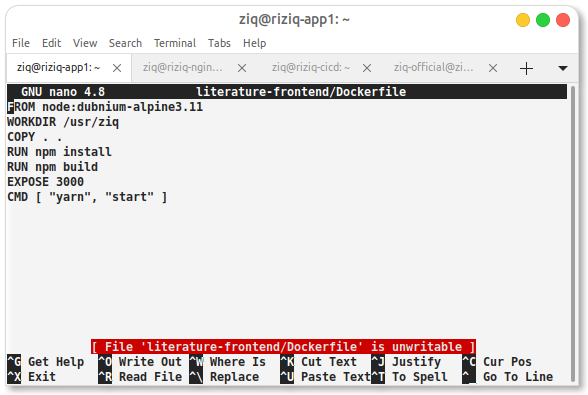
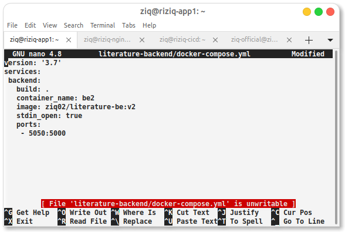
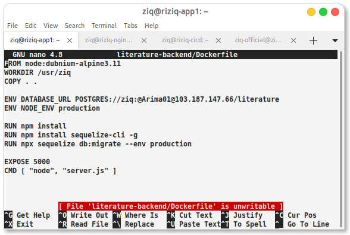
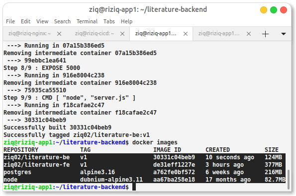
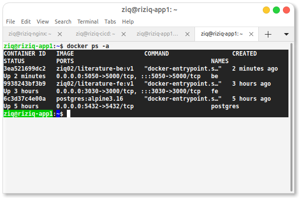
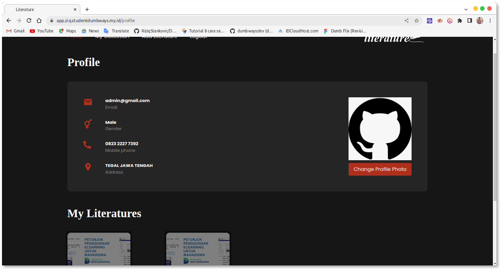

Set up semua app ke dalam docker kemudian congigurasikan


integrasi bagian api di fe





RUNNING APP

Dockerfile >> docker-compose.yml >> Jenkinsfile

docker file 




```
docker build -t <customnama> .
```





```
docker compose up -d
```

semuanya di compose dan running container integrasi ke database agar bisa login 

ini hasilnya sudah di reverse proxy ssl










ok done