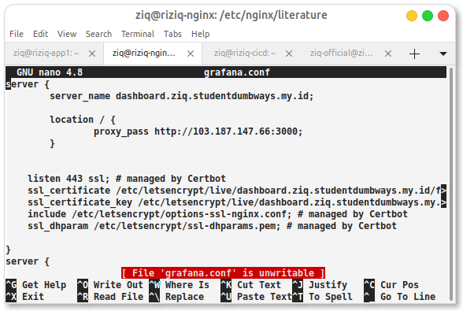

# Install nginx kmudian setup fast

```
sudo apt install nginx; sudo apt install core; sudo apt install refresh core; sudo apt install --classic-certbot; sudo certbot
```


with multilevel domain dns


konfigurasikan semuanya



tambahan buat grafana buat not allowed

```
proxy_set_header Host $http_host;
```


