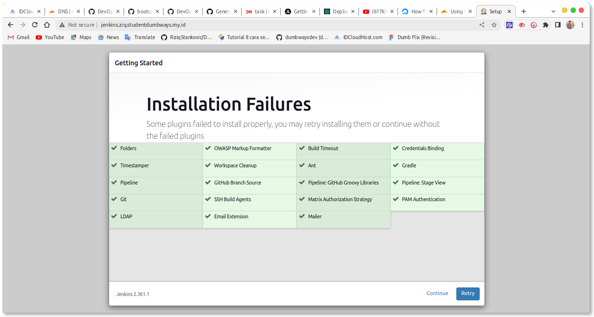
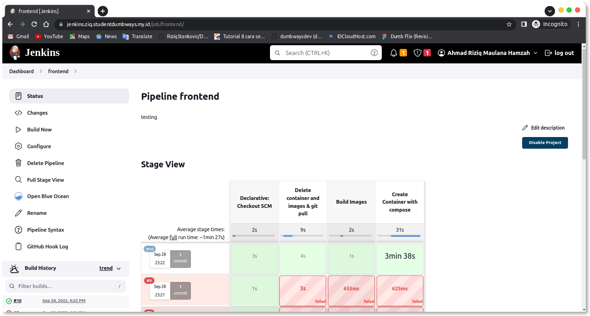
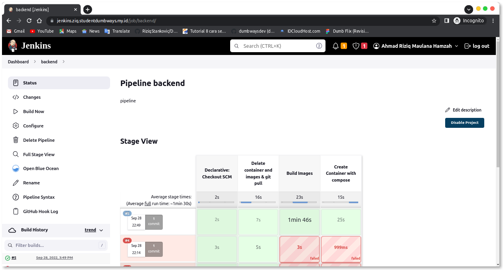
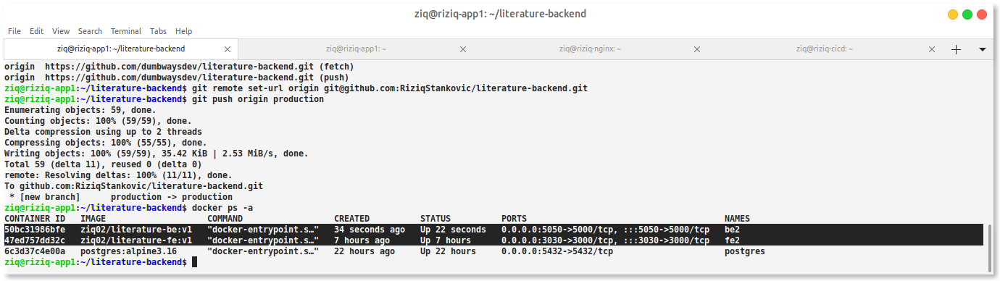
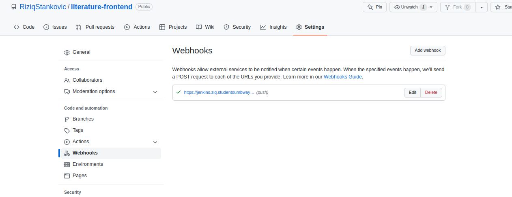

# install jenkins menggunakan ansible

```
- hosts: cicd
  become: true
  tasks:
  - name: Install pip python 3
    shell: sudo apt install python3-docker -y
  - name: jenkins or ziq volume
    file:
     path: /home/ziq/jenkins_home
     state: directory
     owner: 1000
     group: 1000
  - name: Pull Image Jenkins
    docker_image:
     name: jenkins/jenkins
     source: pull
  - name: Run Container jenkins
    docker_container:
     name: jenkins
     image: jenkins/jenkins
     ports:
      - 8080:8080
      - 50000:50000
     volumes: /home/ziq/jenkins_home:/var/jenkins_home
```

Set UP awal jenkins with recomended




note credential with ID to jenkinsfile and use privet keys custom










set up trigger agar otomatis deploy





ok done