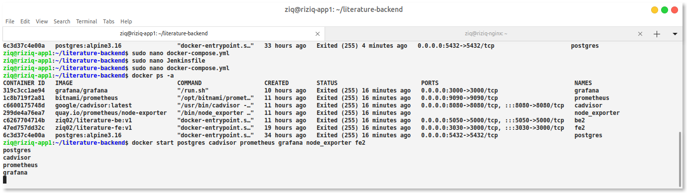
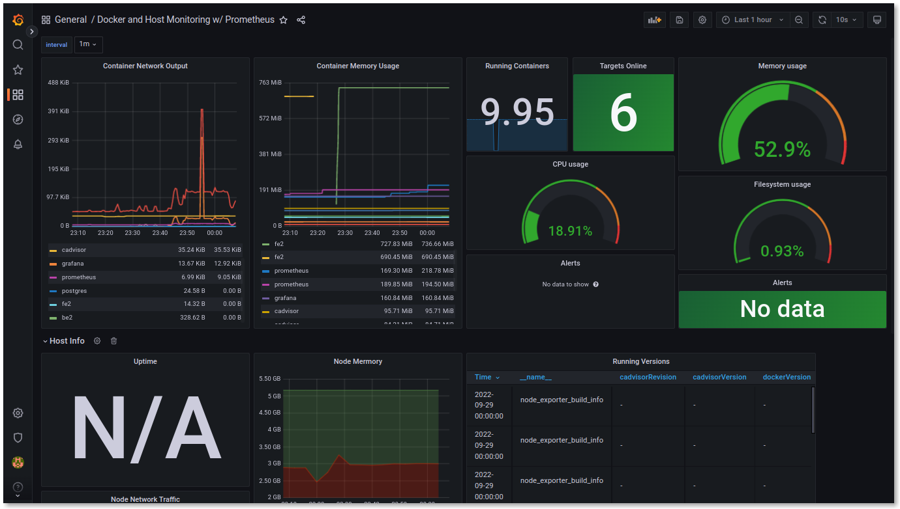

# install menggunakan ansible


```
- hosts: 'all'
  become: yes
  gather_facts: yes
  vars:
    name:
  tasks:
       - name: 'update'
         apt:
          update_cache: yes

       - name: 'upgrade'
         apt:
          upgrade: dist

       - name: 'install python docker'
         shell: sudo apt install python3-docker -y

      #  - name: 'Docker Run Node Exporter'
      #    shell: docker run -d --net="host" --pid="host" -v "/:/host:ro,rslave"
      --name node_exporter quay.io/prometheus/node-exporter --path.rootfs=/host
        
      #  - name: 'Docker Run Cadvisor' 
      #    shell: docker run --volume=/:/rootfs:ro --volume=/var/run:/var/run:rw --volume=/sys:/sys:ro --volume=/var/lib/docker/:/var/lib/docker:ro --publish=8080:8080 --detach=true --link influxsrv:influxsrv --name=cadvisor google/cadvisor:latest 

       - name: "Create a directory "
         ansible.builtin.file:
           path: /home/ziq/prometheus
           state: directory

       - name: 'Copy Config Prometheus'
         copy:
           src: /home/ziq-official/ansibleku/prometheus.yml
           dest: /home/ziq/prometheus


      #  - name: 'Login DockerHub'
      #     docker_login:
      #      username: {username}
      #      password: {password}

       - name: 'Stage 1 Pull image Prometheus'
         docker_image:
           name: bitnami/prometheus
           source: pull

       - name: 'Container Start Prometheus'
         docker_container:
           name: prometheus
           image: bitnami/prometheus
           ports:
             - 9090:9090
           volumes: /home/ziq/prometheus:/etc/prometheus

       - name: 'Stage 2 Pull image Grafana'
         docker_image:
           name: grafana/grafana    
           source: pull

       - name: 'Container Start Grafana'
         docker_container:
           name: grafana
           image: grafana/grafana
           ports:
             - 3000:3000
```


cofigurasikan prometheusnya dan cadvisor nya

dan tinggal sesuikan di data source grafana nya



done ini hasilnya with specific container



